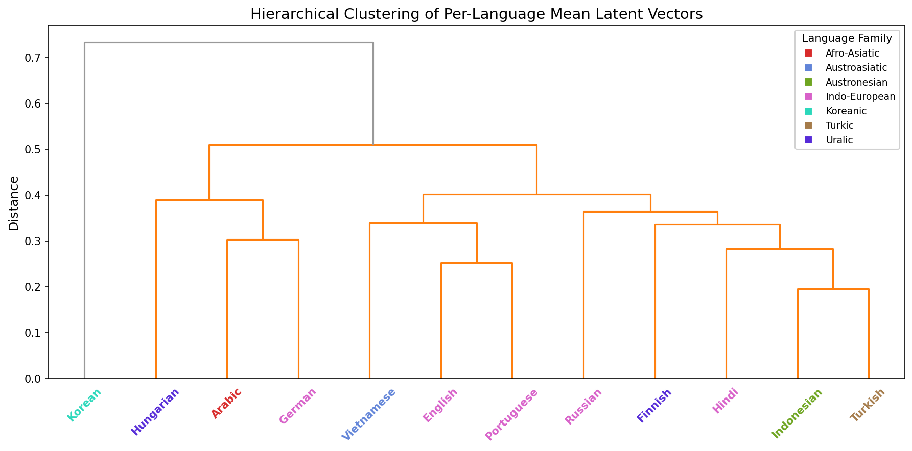
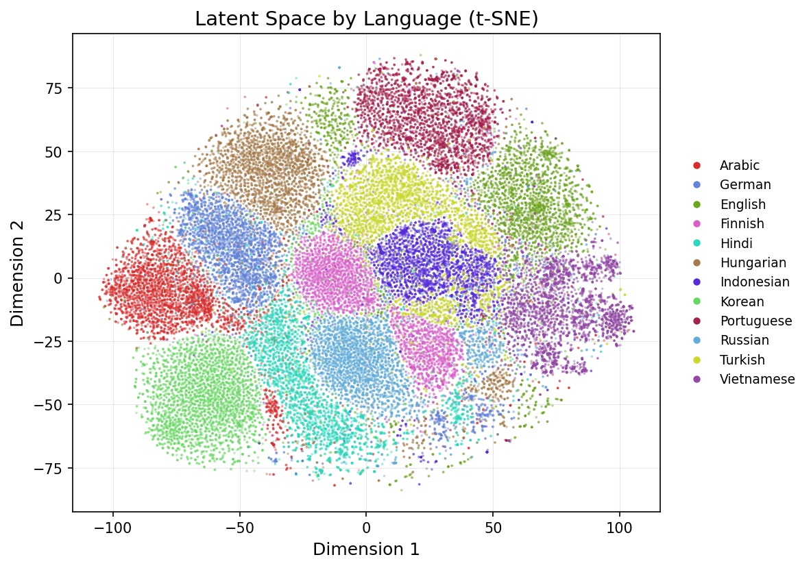
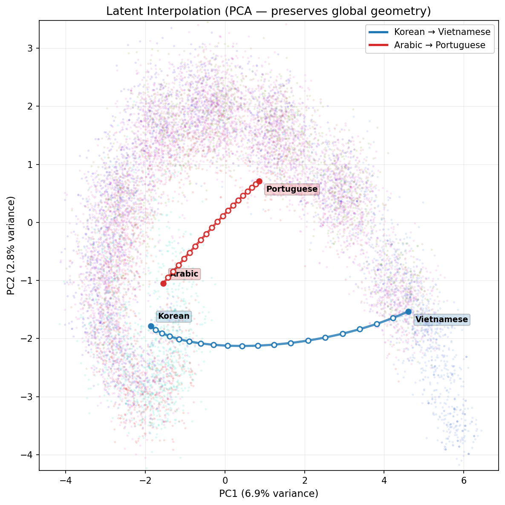
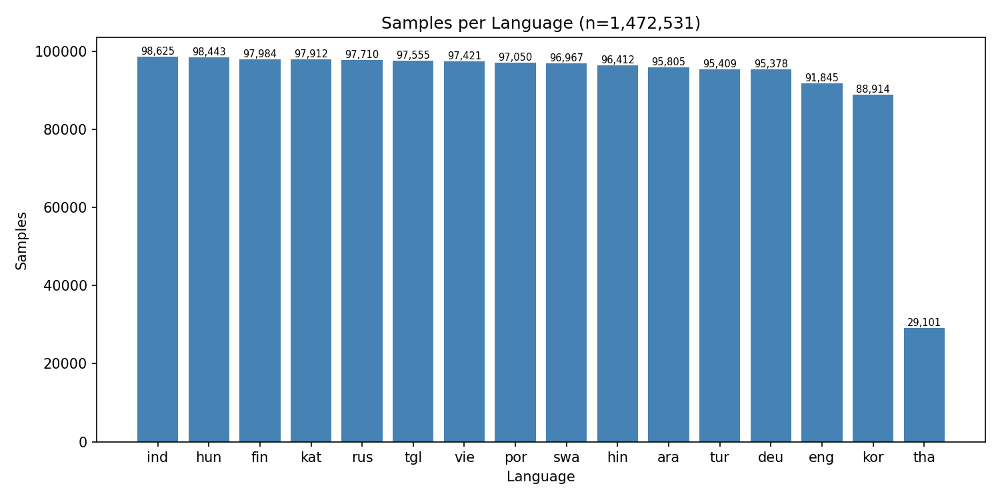
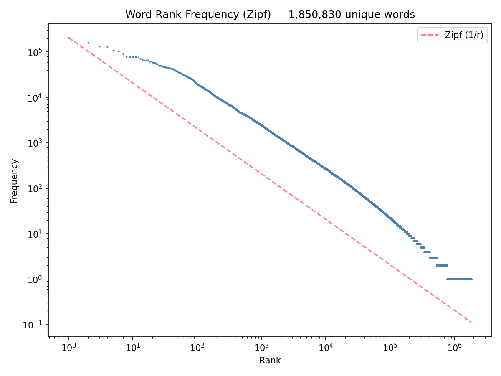
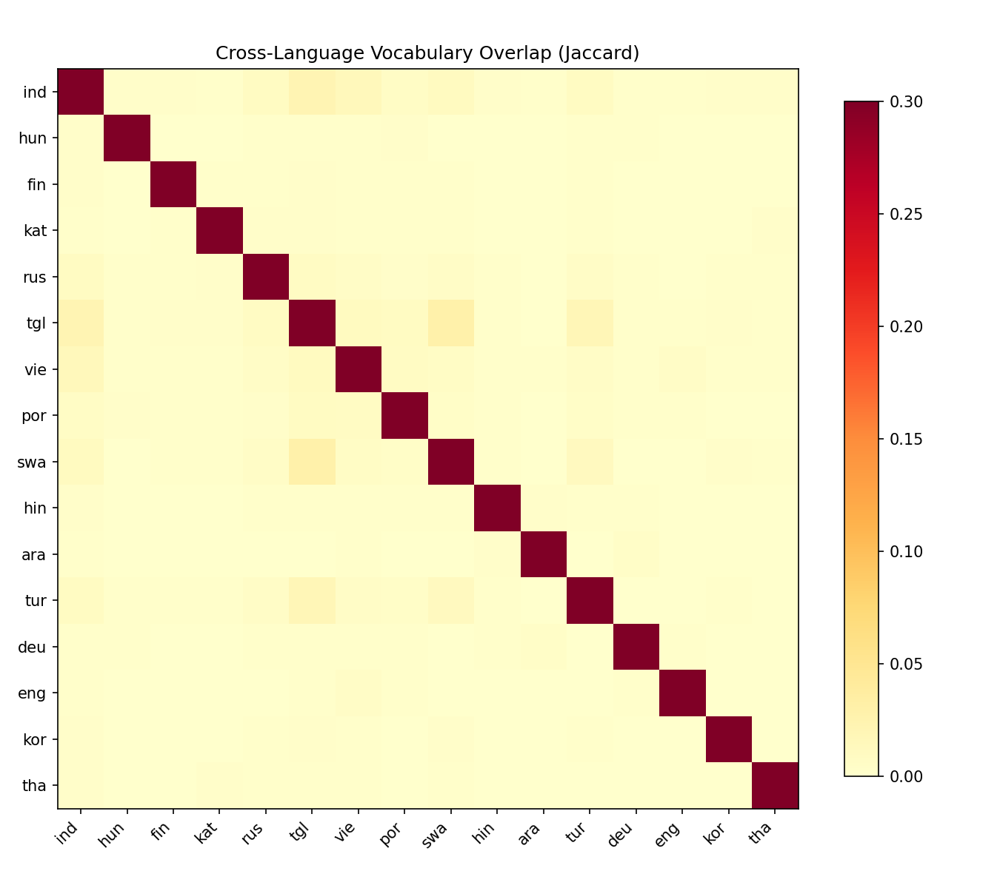

# LFM — Language Faculty Model

A framework for encoding structured data as natural language.

LFM encodes arbitrary continuous representations — agent embeddings, protein features, mathematical structures, any high-dimensional vector — as linguistically structured, pronounceable IPA (International Phonetic Alphabet) utterances. The output is compositional, variable-length, and phonotactically valid: not a cipher or a learned code, but output that shares the structural properties of natural language because it is generated through a decoder pretrained on multiple typologically diverse human languages. This makes it interpretable by any multilingual LLM.

---

**Contents**

1. 🌐 [Vision](#vision) — why encode structured data as natural language
2. 🔬 [The Problem](#the-problem) — limitations of existing encoding approaches
3. ⚙️ [How It Works](#how-it-works) — three-step pipeline overview
4. 🗣️ [The Linguistic Decoder](#the-linguistic-decoder) — architecture, pretraining, sample outputs
5. 🌳 [Expression Generation](#expression-generation) — GRU z-sequence generation with PonderNet halting through the decoder
6. 🎯 [Agent Game Results](#agent-game-results) — Referential and expression game validation (direct backprop)
7. 📊 [Structural Analysis](#structural-analysis) — latent space typology and compositionality metrics
8. 💾 [Dataset Generation](#dataset-generation) — HDF5 pipeline with constituency augmentation
9. 📈 [Visualization CLI](#visualization-cli) — t-SNE, clustering, attention, Zipf, and more
10. 🚀 [Quick Start](#quick-start) — install, pretrain, run
11. 🧬 [Design and Rationale](#design-and-rationale) — why IPA, not pretrained LM output; implementation principles
12. 📋 [Status](#status) — current capabilities and roadmap
13. 📖 [Further Reading](#further-reading) — related docs and background

---

## Vision

Neural systems — agents, encoders, scientific models — produce continuous representations that capture structure no human formalism was designed to express. A protein encoder's embedding of a novel fold, an RL agent's observation of a dynamical system, a GNN's representation of a molecular graph — these are empirically grounded, information-rich, and completely opaque.

LFM makes them speakable. It encodes any continuous representation as a new natural language — not English, not mathematics, but an emergent language whose structure is inherited from a pretrained multilingual decoder. The language is compositional, variable-length, and phonotactically regular. Any multilingual LLM can learn to translate it — and because the language encodes empirical grounding from its source domain, learning the language means acquiring that grounding.

The common critique that LLMs are "not grounded" misidentifies the problem. LLMs trained on English are grounded — in human perception of quality and correctness, which is subjective and domain-dependent. An LLM reasoning about protein folding in English is constrained by how humans talk about proteins, not by how proteins actually behave. A language whose semantics decode back to the empirical behavior of a physical system, rather than to human judgment, grounds the LLM in something verifiable: generate a claim in the alien language, decode it, compare to physical reality.

The key mechanism is a **frozen linguistic bottleneck**: a VAE decoder pretrained on typologically diverse languages, then frozen. Downstream systems don't learn a communication protocol from scratch — they learn to project their representations into the decoder's latent space, and the decoder's structure constrains the output to be linguistically well-formed. This is analogous to Universal Grammar in the Chomskyan sense: a fixed structural prior that constrains the space of possible languages, where only the mapping from meaning to form is learned. This avoids the known failure modes of end-to-end emergent communication (anti-Zipfian codes, degenerate protocols, non-compositional signals).

The pipeline is concrete: an input embedding is projected into a VAE latent space, decoded through a frozen multilingual transformer into IPA tokens, and the resulting utterance carries enough structure for a receiver to identify what was encoded (99.2% peak accuracy, 15.9x above chance in a referential game). An LLM can then learn to translate the emergent IPA into English. At every step, the information is empirically grounded and the fidelity is measurable.

## The Problem

Any system that needs to express continuous representations as structured, interpretable sequences faces a choice:

- **Natural language** imposes human ontology and semantic bias
- **Latent vector passing** lacks structure and interpretability
- **Learned discrete codes** (VQ-VAE, emergent protocols) collapse into degenerate, non-compositional signals
- **Symbolic systems** are rigid and not adaptive
- **JSON / structured serialization** is not compositional and has no linguistic inductive bias

LFM provides an alternative: a **frozen linguistic bottleneck** that constrains any input to be expressed as compositional, variable-length, phonotactically valid natural language — without inheriting the semantics of any human language. The structure comes from the decoder; the meaning comes from whatever is being encoded.

This applies to multi-agent communication, but also to any setting where you want to encode structured data as interpretable natural language: scientific observation, mathematical expression, sensor fusion, latent space navigation.

### Translation, not alignment

The emergent language that LFM produces is not human language — but it is *language-like*. It has morphology, phonotactic structure, and compositional regularity. This is by design: the structural inductive biases come from the frozen decoder, which was pretrained on typologically diverse human languages.

Because the output is in IPA — a universal phonetic representation — and because the decoder was pretrained on 12 typologically diverse human languages, the emergent language inherits the universal structural patterns that all human languages share: morphological regularity, phonotactic constraints, compositional hierarchy. A multilingual foundation LLM already has deep representations of these patterns from training on 100+ human languages. The alien language is language 101 — the LLM's existing cross-lingual transfer machinery should recognize its structure without supervised translation pairs.

The training path is **self-supervised**: continue training a multilingual foundation model on a corpus of alien IPA text. No paired translations. The LLM learns the distributional structure of the alien language the same way it learned every other language — from corpus statistics. Because the alien language's compositional patterns activate the same internal features that human languages activate (they were forged by the same linguistic decoder), zero-shot or few-shot translation emerges naturally. Prompt with alien IPA, ask for English, and the LLM's cross-lingual transfer produces a translation — the same way multilingual LLMs translate between language pairs they were never explicitly trained on.

Crucially, this is translation, not latent space alignment. The source ontology stays intact; the LLM does the interpretive work. And because the LLM learns the alien language *as a language* — not as an encoding to decode — the translation is **bidirectional**. The same model that translates alien IPA → English can generate alien IPA from English. This closes a full communication loop: the system speaks, a human reads the translation, responds in English, the LLM translates back into the emergent language, and the system receives it. Bidirectional dialogue mediated by a shared alien language, with the LLM as interpreter — no paired training data required.

Translation is inherently lossy — but language compensates for that. Unlike a fixed-size code, language can expound: use more words, more phrases, more compositional structure to progressively encapsulate meaning that a single utterance would lose. This is exactly what LFM's expression system exploits. The GRU z-sequence generator produces variable numbers of segments as needed — with PonderNet halting deciding when enough has been said — to elaborate on complex inputs, trading efficiency for fidelity the same way natural language does.

## How It Works

LFM uses a **generative linguistic bottleneck**: a pretrained VAE decoder that produces linguistically structured IPA output from a latent space.

### Step 1: Pretrain the VAE decoder

A multilingual VAE is trained on IPA-transcribed phrase-level constituents from typologically diverse languages (Leipzig Corpora Collection). The v5-leaf training set covers 12 languages spanning major morphological types:

| Typology | Languages |
|----------|-----------|
| Fusional | English, German, Portuguese, Russian |
| Agglutinative | Turkish, Finnish, Hungarian, Korean |
| Isolating/Tonal | Vietnamese, Indonesian |
| Introflexive | Arabic |
| Split-ergative | Hindi |

The training corpus consists of 4M **leaf-level** phrase constituents (NP, VP, PP, ADJP, ADVP, S, SBAR) extracted via unified UD dependency-to-constituency conversion with Stanza dependency parsers. Only leaf constituents are kept -- the atomic building blocks of syntax. Vietnamese IPA is recovered via word-alignment of constituents against parent sentence IPA (fallback for languages where epitran's word-level IPA doesn't align with constituent spans). v5-leaf trains on standalone leaf constituent IPA sequences (no constituent_context -- each sample IS a short phrase), so the decoder learns phrase-level EOS naturally. The expression game then composes these atomic phrases into multi-segment utterances. Text is converted to IPA via epitran (non-English) and the CMU Pronouncing Dictionary (English), tokenized with syllable-aligned sentencepiece BPE (`max_seq_len=27`, auto-scaled from dataset).

The decoder uses a **LinguisticDecoder** with architectural biases for natural language:
- **Rotary Positional Embeddings (RoPE)**: translation-invariant pattern learning — a morpheme works the same way regardless of position
- **Multi-scale attention heads**: window sizes of 3 (phonotactic), 7 (morpheme), 15 (word), and full (clause) — a multi-resolution linguistic filter bank
- **Weight-shared layers**: 2 unique layers applied 4 times = literal recursion, mirroring syntactic Merge

Training uses cosine LR decay, DIP-VAE covariance regularization (off-diagonal penalty to encourage dimension independence), and a variance floor to prevent latent collapse.

After pretraining, the decoder is **frozen**. It becomes a fixed linguistic bottleneck.

### Step 2: Expression generation

The frozen decoder is wrapped by an `ExpressionGenerator` that learns to produce multi-segment expressions via a GRU z-sequence with PonderNet halting. During training:

1. An input embedding (e.g., 384-dim from any encoder) enters the expression generator
2. **z_0** is a direct projection of the input (discriminative from step 0)
3. A **GRU** autoregressively generates subsequent z vectors (z_1..z_K), conditioned on prior segments
4. **PonderNet halting** decides when to stop: a per-step halt probability regularized toward a geometric prior p(k) = lambda(1-lambda)^{k-1}, preventing segment count explosion without manual tuning
5. Each z is **decoded through the frozen decoder** until EOS, with the KV cache persisting across segments for coarticulation
6. An `ExpressionEncoder` composes the decoded segments into a fixed-size message vector

Only the expression generator and encoder learn. The decoder's linguistic structure is preserved. This approach replaces the earlier REINFORCE tree topology with a fully differentiable GRU + PonderNet architecture.

### Step 3: Variable-length, variable-structure messages

Expression complexity scales with input complexity. The GRU can produce more segments to elaborate on complex inputs, with PonderNet halting deciding when enough has been said. Short, simple inputs produce fewer segments with brief output. With the v5-leaf decoder, each segment is an atomic phrase (mean 2.5 words), and the expression game composes ~2.6 such phrases into multi-segment utterances (~15 tokens total). This is the same mechanism natural language uses: say more when there's more to say.

## The Linguistic Decoder

The core of LFM is a **pretrained multilingual VAE decoder** that produces linguistically structured IPA from a latent vector. After pretraining, it is frozen and becomes a fixed linguistic bottleneck for downstream use.

### Decoder architecture

```
z (384-dim latent vector)
  → latent_to_decoder projection
  → frozen LinguisticDecoder
      |-- RoPE (translation-invariant positions)
      |-- Multi-scale attention heads (3/7/15/full token windows)
      +-- Weight-shared layers (2 unique × 4 applications = recursion)
  → variable-length IPA tokens (max_seq_len=27)
```

The **LinguisticDecoder** has architectural biases for natural language:
- **Rotary Positional Embeddings (RoPE)**: a morpheme works the same way regardless of position
- **Multi-scale attention heads**: window sizes of 3 (phonotactic), 7 (morpheme), 15 (word), and full (clause) — a multi-resolution linguistic filter bank
- **Weight-shared layers**: 2 unique layers applied 4 times = literal recursion, mirroring syntactic Merge

### Pretraining

The decoder is trained on IPA-transcribed text from typologically diverse languages (Leipzig Corpora Collection). Training uses cosine LR decay (per-epoch), DIP-VAE covariance regularization, and full resume support.

**v5-leaf-27 (current, leaf-level phrases)**: 4M leaf-level IPA phrase constituents (NP, VP, PP, ADJP, ADVP, S, SBAR) from 12 typologically diverse languages (eng, deu, por, rus, tur, fin, hun, kor, vie, ind, ara, hin), extracted via dep-to-constituency parsing with word-alignment fallback for Vietnamese. Syllable-aligned BPE tokenization, `max_seq_len=27` (auto-scaled from dataset), 8-token z memory (multi-token cross-attention), latent_dim=256, decoder_hidden_dim=512, 8-head multi-scale attention [3,3,7,7,15,15,full,full], weight-shared layers (2 unique x 4). Standard VAE on standalone leaf constituent IPA sequences (no constituent_context -- each sample IS a short phrase), so the decoder learns phrase-level EOS naturally.

### Pretraining results

4M leaf-level IPA phrase constituents (NP, VP, PP, ADJP, ADVP, S, SBAR) from 12 languages, syllable-aligned BPE, max_seq_len=27, 8-token z memory (latent_dim=256, lr=0.0005):

| Metric | Value |
|--------|-------|
| Val CE (short, <20 BPE) | **0.006** |
| Val CE (medium, 20-50 BPE) | **0.065** |
| Val CE (overall) | **0.0071** |
| Variable-length output | mean 2.5 words (16.5 IPA chars), range 1-4 words |
| Zipf exponent | corpus 1.004, decoded 1.058 (near-perfect Zipf law) |
| Adaptiveness (input<->output length) | r=1.000 |
| Adaptiveness (z_norm<->output_unique) | r=-0.663 |
| TTR | 1.000 (every word unique within a phrase) |
| EOS rate | 1.00 (always produces well-formed EOS) |

<p align="center">
  
  
</p>
<p align="center"><em>Left: hierarchical clustering recovers linguistically sensible language groupings. Right: t-SNE by language — 12 distinct clusters with typologically sensible overlap zones. Full analysis in <a href="docs/structural-analysis.md">docs/structural-analysis.md</a>.</em></p>

### Reconstruction

The v5-leaf-27 decoder achieves near-perfect reconstruction on leaf phrases (val CE=0.006 for <20 BPE tokens, val CE=0.065 for 20-50 BPE tokens). Leaf-only training means the decoder specializes in atomic phrase production, and the expression game composes them.

### Cross-typological Interpolation

The latent space supports smooth interpolation between typologically distant languages. Pairs are auto-selected by maximum z-distance across language family boundaries:

<p align="center">
  
</p>
<p align="center"><em>Korean→Vietnamese (Koreanic agglutinative → Austroasiatic isolating) and Arabic→Portuguese (Afro-Asiatic introflexive → Indo-European fusional). Decoded IPA transitions smoothly through intermediate typological regions.</em></p>

### Perturbation

Adding noise scaled to the encoder's z distribution to the same z vector. sigma=0.5 preserves language-local phonotactics with content shifts, sigma=1.0 shows mixed typology, and sigma=2.0 crosses entirely into different typological families — the decoder navigates continuously through the latent manifold.

## Expression Generation

LFM includes a learnable **expression system** for multi-segment communication through the linguistic bottleneck. Instead of mapping one embedding to one flat utterance, an agent produces a variable number of segments via a **GRU z-sequence generator** with **PonderNet geometric-prior halting** (Banino et al., ICML 2021). Each segment's z vector is decoded through the frozen decoder, with the KV cache persisting across segment boundaries for phonotactically coherent coarticulation. This replaces the earlier REINFORCE tree topology approach with a fully differentiable architecture.

```
    z₀ ← input_proj(embedding)     (discriminative from step 0)
    z₁ ← GRU(z₀)                   halt? p₁
    z₂ ← GRU(z₁)                   halt? p₂
    ...                             (PonderNet geometric prior: λ=0.4 → E[K]=2.5)

    Decode:  [BOS ðʌ kwɪk braʊn | fɑks dʒʌmpt | oʊvɝ ðʌ leɪzi dɑɡ EOS]
                  memory=z₀          memory=z₁     memory=z₂
                  (continuous KV cache — no breaks)
```

**Key design decisions:**
- **z_0 = direct projection**: The first segment is immediately discriminative, matching the referential game's single-z approach
- **GRU continuation**: Subsequent z vectors are generated autoregressively, conditioned on prior segments
- **PonderNet halting**: Per-step halt probability regularized toward geometric prior p(k) = lambda(1-lambda)^{k-1}. KL divergence prevents segment count explosion without manual tuning
- **Two-phase backprop**: Same as referential game — no_grad generation, then parallel decoder re-run with gradients through cross-attention

**Components** (`lfm.expression`):

| Module | Role |
|--------|------|
| `ExpressionGenerator` | GRU z-sequence + PonderNet halting + continuous z-switching decode through frozen decoder |
| `Expression` | Data structure: z vectors, decoded tokens, segment boundaries, halt probabilities |
| `ExpressionEncoder` | Segment pooling + composition → fixed-size message vector |
| `ExpressionConfig` | Configuration for all expression system parameters |

**Plug-and-play integration** — works with any agent that produces fixed-size embeddings:

```python
from lfm.expression import ExpressionGenerator, ExpressionEncoder

expr_gen = ExpressionGenerator(generator=frozen_decoder, input_dim=384, ...)
expr_enc = ExpressionEncoder(hidden_dim=512, output_dim=384)

expression = expr_gen(agent_embedding)   # GRU z-sequence + decode
message = expr_enc(expression)           # fixed-size message vector
```

No decoder retraining needed. The z-switching mechanism exploits properties the decoder already has from pretraining on natural language.

See [docs/expression-system.md](docs/expression-system.md) for the full design document covering motivation, architecture details, continuous z-switching decode, integration guide, and downstream applications.

### Sample outputs (v1)

**Reconstruction** (English — all content words recovered, minor word order shuffle):
```
orig: mækswɛl sɛd hi meɪd fɹɛndz fɔɹ laɪf ɑn ðʌ ʃoʊ wɪtʃ ɪnkludʌd ðʌ ʌðɝ ækts
dec:  mækswɛl sɛd hi meɪd fɔɹ fɹɛndz laɪf ɑn ðʌ ʃoʊ wɪtʃ ɪnklud ðʌ ʌðɝ ækts
```

**Interpolation** (English → Portuguese — smooth typological transition):
```
0.00: mækswɛl sɛd hi meɪd fɔɹ fɹɛndz laɪf ɑn ðʌ ʃoʊ wɪtʃ ɪnkludʌd ðʌ ʌðɝ ækts
0.50: ɛʃtowu fɛksʌz dɛliz sɛd ðæt hi meɪd ðʌ jɪɹ fɹʌm ðʌ swʌŋ fɹeɪnz laɪf aʊtmæs wɑz viʃɪŋ
1.00: ɛʃtowu mujto fɛliz dɛ ɾɛtomɐɾ os sows dɛpowis dɛ dowis ɐnos dɛʃsɛs mudɐnsɐs ɛ tɐntɐs
```

**Perturbation** (σ=0.5 — sentence frame holds, content words shift):
```
σ=0.0: mækswɛl sɛd hi meɪd fɔɹ fɹɛndz ʃoʊ ɑn ðʌ laɪf wɪtʃ ɪnkludʌd ðʌ ækts ʌðɝ
σ=0.5: mækswɛl hi meɪd sɛd laɪf fɹɛndz ɑn ðʌ menlis wɪtʃ fɔɹ ðʌ æstɪʃoʊz klɑpd
σ=1.0: mækskswɛnd vlad ɔranfilt͡ɕɛ r sɛd aɪ meɪd ðætrne carne ɔ fɔɹmɝ fɹɪtel buktɨ ʌðɝ hetwʌzʔau ...
```

### Package structure

```
src/lfm/
  expression/           # GRU z-sequence expression generation with PonderNet halting (this section)
    generator.py        # ExpressionGenerator (GRU z-sequence + PonderNet + continuous z-switching decode)
    encoder.py          # ExpressionEncoder (segment pooling + composition)
    expression.py       # Expression dataclass
  faculty/              # LanguageFaculty compositor
  generator/            # VAE generator, linguistic decoder, pretraining
    layers.py           # LinguisticDecoder (RoPE + multi-scale attention)
    multilingual_vae.py # MultilingualVAEGenerator
    pretrain.py         # Full pretraining pipeline
  data/                 # Corpus datasets, loaders, IPA conversion
    sanitize.py         # Configurable text sanitization
    dataset/            # HDF5 dataset generation + reader
    loaders/            # Leipzig loader, IPA converter
  cli/                  # CLI framework (lfm dataset, visualize, translate, publish)
  embeddings/           # LLM embedding games, sampler, prefetcher
  visualize/            # Visualization suite (t-SNE, clustering, attention, etc.)
```

## Structural Analysis

Detailed visualization evidence for the model's structural properties — latent space organization, attention hierarchy, Zipf's law, smoothness, adaptive length, compositionality, cross-typological interpolation, and per-dimension latent sweeps — is presented in **[docs/structural-analysis.md](docs/structural-analysis.md)**, generated via the `lfm visualize all` and `lfm explore dim-sweep` CLI commands.

Key findings:
- **Adaptiveness**: input<->output length r=1.000, z_norm<->output_unique r=-0.663
- **Zipfian output**: corpus exponent 1.004, decoded 1.058 — near-perfect Zipf law
- **Variable-length output**: mean 2.5 words (16.5 IPA chars), range 1-4 words — atomic phrases
- **TTR**: 1.000 (every word unique within a phrase)
- **EOS rate**: 1.00 (always produces well-formed EOS)
- **Functional compositionality**: specific z dimensions control specific output properties
- **Multi-scale attention**: architectural hierarchy confirmed in per-head entropy analysis

## Agent Game Results

### Referential Game

Referential game with direct backprop through the v5-leaf frozen decoder, using real LLM embeddings (all-MiniLM-L6-v2, 384-dim, 10K English sentences). 16-way discrimination (15 distractors, 6.25% chance) with curriculum-controlled hard negatives:

| Metric | Value |
|--------|-------|
| Accuracy (100% hard negatives) | **~96%** (chance = 6.25%) |
| Peak batch accuracy | **99.2%** |
| Improvement over chance | **15.9x** |
| Message length | ~41 tokens |
| Loss at plateau | 0.05-0.08 |
| Batch size | 256 |
| Convergence | ~50 steps to >95% |

### Two-phase backprop

Gradients flow directly from the receiver's cross-entropy loss through the frozen decoder's cross-attention to the latent memory, back to the sender's `_input_proj`. No REINFORCE needed — the decoder's cross-attention is the gradient highway. Phase 1 generates tokens via fast KV-cached decode (no_grad); phase 2 re-runs the decoder on those tokens in one parallel pass with gradients enabled. An attention-based message encoder (2-layer self-attention + learned query readout) reads the decoder's multi-scale hidden states.

```
step=0    hard=0%    acc=7.0%    (random init)
step=50   hard=10%   acc=99.2%
step=250  hard=50%   acc=96.9%
step=500  hard=100%  acc=95.7%
step=1000 hard=100%  acc=97.3%
step=1500 hard=100%  acc=95.7%   (stable plateau)
```

### Example outputs

English sentences encoded with all-MiniLM-L6-v2, projected through the trained `_input_proj` (from the best checkpoint at 98.4% accuracy), and decoded through the frozen v5-leaf decoder:

```
ENG: "The committee voted unanimously to approve the new environmental regulations."
IPA: vɤj ŋɯəj tɑm bo ʒon inʈaŋ jos ɲɤ̆t cuŋ zăn dɔŋ ðæt dɛu kɔ the lam thɯŋ xiən haj kwa ...
     (36 tokens)

ENG: "She picked up the old guitar and played a melody her grandmother used to sing."
IPA: ursəkrə drɛːɦaːr bunkiːdaːren ʕʃr kiʃho ekʃumiː ke ləŋkaːraː vitɒl ɦo midmiːlt kiəw ...
     (42 tokens)

ENG: "Quantum entanglement allows particles to be correlated regardless of distance."
IPA: ʋuotɑ mehmæn ejrenhoun inisɑ me infji uboloɡisæ kuŋ saanix junijɑ kʌresi ...
     (41 tokens)

ENG: "The local bakery on Fifth Street makes the best sourdough bread in town."
IPA: wɪtɯnɹi ðʌ ɡaj spɝ sɛz ɪnkliɪŋ ðʌ sɪŋɡwatʃɝ ʃikɛr pɹʌ ɛlmʌndɪŋz liəwt͡ɕ aŋɯl ...
     (36 tokens)

ENG: "After three days of heavy rain, the river burst its banks and flooded the valley."
IPA: kɛɲ sɤ̆w mɔʃɛfta kəsiɾ to kwa samaŋ doj vɤj betandowok zoŋnoθa titsɛ diz biztɔstɔːas ...
     (42 tokens)

ENG: "The stock market crashed by 12% following the surprise interest rate announcement."
IPA: dokusnɨm ljaɡmounden ve k krɔmjamuʃomout ɒz i kjʌbesa rasko tɤ̆j utmundom i bjebtʃesa ...
     (44 tokens)
```

Each input produces a distinct, pronounceable IPA utterance (~36-44 tokens). The output draws on phonotactic patterns from all 12 training languages — the decoder mixes typological features (Vietnamese tones, Hungarian consonant clusters, Arabic pharyngeals, English fricatives) into novel linguistic forms that are neither any specific human language nor a degenerate code. Semantically similar inputs produce similar-sounding utterances (measurable via Topsim), while dissimilar inputs produce clearly distinct ones.

### Structural evaluation

After training with curriculum hard negatives (16-way, 100% within-cluster distractors):

| Metric | Value |
|--------|-------|
| Topsim (hidden cosine) | **0.335** (p~0) |
| Topsim (token edit) | **0.074** (p=1.8e-7) |
| Topology preservation (hidden cosine) | **0.366** (p~0) |
| Topology preservation (edit distance) | **0.128** (p~0) |
| Topology preservation (token Jaccard) | **0.202** (p~0) |
| Diagnostic probe mean R-squared | **0.183** |
| Probe dims with R-squared > 0 | **100%** |

All metrics are highly significant. Similar inputs produce similar messages (topology preservation), and the message hidden states encode recoverable information about the input (diagnostic probe). The hidden-state topsim of 0.335 confirms that the frozen decoder's latent space preserves compositional structure under the learned mapping.

### Expression Game

The expression game uses a **GRU-based z-sequence generator** with **PonderNet geometric-prior halting** (Banino et al., ICML 2021) instead of the earlier REINFORCE tree topology. This is a fully differentiable approach to multi-segment expression generation.

**Architecture:**
- **z_0**: Direct projection of input embedding (discriminative from step 0, same as referential game)
- **z_1..z_K**: GRU autoregressively generates subsequent z vectors conditioned on prior segments
- **Each z**: Decoded through the frozen decoder until EOS, with KV cache persisting across segments for coarticulation
- **PonderNet halting**: Per-step halt probability regularized toward geometric prior p(k) = lambda(1-lambda)^{k-1}. lambda=0.4 gives E[K]=2.5 segments. KL divergence prevents segment count explosion without manual tuning
- **Two-phase backprop**: Same as referential game — no_grad generation, then parallel decoder re-run with gradients through cross-attention

| Metric | Value |
|--------|-------|
| Peak accuracy (100% hard negatives) | **93.8%** |
| Segments per message | ~2.6 (stable, PonderNet-regulated) |
| Average message length | ~15 tokens (~6 tokens per segment) |
| Convergence | ~50 steps to >95% |

```bash
# Train expression game with defaults
poetry run lfm agent expression --steps 2000 --batch-size 256

# Tune segment count: lower lambda = more segments
poetry run lfm agent expression --lambda-p 0.3 --kl-beta 1.0
```

## Dataset Generation

LFM includes a standalone dataset generation pipeline that preprocesses raw corpus text into reusable HDF5 datasets. This decouples preprocessing from pretraining — generate once, reuse across experiments.

The pipeline: **load** (corpus loader) → **sanitize** (configurable rule-based filters) → **LLM gate** (optional quality validation via small LM) → **IPA conversion** → **balance** (per-language caps) → **HDF5 output** (LZ-compressed, with rejected samples saved for inspection).

```bash
poetry install --with datasets

# Generate from Leipzig corpus
lfm dataset generate --source leipzig

# Custom: specific languages, skip LLM gate for speed
lfm dataset generate --source leipzig \
  --languages eng deu pol hin ara \
  --max-samples 50000 \
  --no-llm-gate

# List installed datasets
lfm dataset list --detail
```

Each dataset is self-contained at `data/datasets/<name>/`:

```
data/datasets/leipzig/
  manifest.yaml    # Metadata: languages, sample counts, config used
  samples.h5       # Accepted samples (IPA + raw text + provenance)
  rejected.h5      # Rejected samples with rejection reasons
```

Dataset diagnostics (`lfm visualize dataset --dataset-path <path>`):

<p align="center">
  
  
</p>
<p align="center">
  
</p>
<p align="center"><em>Left: per-language sample distribution. Right: IPA word frequency follows Zipf's law — confirming natural language statistics. Bottom: Jaccard vocabulary overlap between languages reveals typological groupings (e.g., Romance languages share more IPA vocabulary than Turkish–Korean).</em></p>

Pretraining can load directly from a generated dataset — no inline sanitization or IPA conversion:

```yaml
# configs/pretrain_vae.yaml
dataset_path: data/datasets/leipzig
```

### Sanitization

Configurable via `--sanitize-*` CLI flags. Key options:

| Setting | Default | Description |
|---------|---------|-------------|
| `number_policy` | `spell_out` | `reject` / `strip` / `keep` / `spell_out` (numbers → words) |
| `symbol_policy` | `spell_out` | Greek/math symbols: `reject` / `strip` / `keep` / `spell_out` (α → alpha) |
| `max_foreign_script_ratio` | 0.3 | Code-switching threshold (reject mixed-script lines) |
| `require_terminal_punctuation` | true | Require sentence-final punctuation |

See **[docs/data-guide.md](docs/data-guide.md)** for the full HDF5 schema and configuration reference.

## Visualization CLI

LFM includes a CLI visualization suite for generating publication-quality diagnostic plots from a trained VAE checkpoint. All plots in the Structural Analysis section above were generated with this tool.

```bash
poetry install --with viz    # matplotlib + seaborn
poetry run lfm visualize --help
```

### Subcommands

| Command | Description |
|---------|-------------|
| `lfm visualize tsne` | t-SNE/UMAP projections of latent space by language, family, morphological type |
| `lfm visualize clustering` | Hierarchical dendrogram and pairwise distance heatmap |
| `lfm visualize attention` | Per-head attention entropy and attention pattern heatmaps |
| `lfm visualize latent-dims` | Per-dimension variance, PCA, language discrimination F-statistics |
| `lfm visualize length-dist` | Output length distributions, length vs z-norm correlation |
| `lfm visualize interpolation` | Cross-typological interpolation trajectories and decoded text |
| `lfm visualize zipf` | Token rank-frequency plots and Zipf exponent comparison |
| `lfm visualize compositionality` | Diagnostic probe R-squared, mutual information by dimension |
| `lfm visualize smoothness` | Lipschitz smoothness, Jaccard correlation, interpolation continuity |
| `lfm visualize adaptiveness` | Input/output length correlation, complexity profiles |
| `lfm visualize all` | Run all visualizations in sequence |

### Usage

```bash
# Single visualization
lfm visualize tsne --checkpoint data/vae_resume.pt

# All visualizations
lfm visualize all --checkpoint data/vae_resume.pt --output-dir output/viz

# Options: --format png|svg|pdf, --dpi 150, --device cuda, --max-samples 50000
```

## Quick Start

```bash
poetry install --with generator,viz,datasets
```

### 0. Download corpus data

```bash
# Automated download of all 16 Leipzig corpora
poetry run lfm setup data --corpus leipzig

# Or download everything (corpus + embeddings)
poetry run lfm setup data --all
```

See **[docs/data-guide.md](docs/data-guide.md)** for the full data layout, checkpoint structure, and consistency verification details.

### 1. Generate dataset (recommended)

Pre-generate an HDF5 dataset for reproducible, fast pretraining:

```bash
lfm dataset generate --source leipzig --no-llm-gate
```

### 2. Pretrain the VAE decoder

Everything starts here. This produces the frozen decoder checkpoint that all downstream tasks use.

```python
from lfm.generator.pretrain import pretrain_vae_decoder, VAEPretrainConfig

# Using pre-generated dataset (fast — no inline preprocessing)
metrics = pretrain_vae_decoder(VAEPretrainConfig(
    dataset_path="data/datasets/leipzig",
))

# Or legacy: inline corpus loading + sanitization + IPA conversion
metrics = pretrain_vae_decoder(VAEPretrainConfig(
    corpus_loader="leipzig",
    corpus_loader_config={"data_dir": "data/leipzig"},
))
```

Once pretraining is complete, use the decoder for any of the following independently:

---

**Inspect the model** — generate publication-quality visualizations of the latent space, attention patterns, smoothness, compositionality, and Zipf analysis:

```bash
lfm visualize all --checkpoint data/vae_resume.pt
```

**Run the referential game** — train an input projection to encode LLM embeddings through the frozen decoder:

```bash
python scripts/precompute_embeddings.py        # one-time: sentence embeddings
poetry run lfm agent referential               # train with defaults (batch 256, 2000 steps)
poetry run lfm agent referential --help        # see all options
```

**Run the expression game** — multi-segment generation with GRU z-sequence and PonderNet halting:

```bash
poetry run lfm agent expression                                    # train with defaults
poetry run lfm agent expression --steps 2000 --batch-size 256      # custom settings
poetry run lfm agent expression --lambda-p 0.3 --kl-beta 1.0      # more segments
```

**Use in your own agent system** —

```python
from lfm import FacultyConfig, GeneratorConfig, LanguageFaculty

faculty = LanguageFaculty(FacultyConfig(
    dim=384,
    generator=GeneratorConfig(
        pretrained_decoder_path="data/vae_decoder.pt",
        spm_model_path="data/spm.model",
        freeze_decoder=True,
    ),
))

# Agent embedding -> linguistic output
outputs = faculty(agent_embedding)  # (batch, dim)
# outputs["generator.tokens"] -- IPA token IDs
# outputs["generator.embeddings"] -- decoder hidden states
# outputs["generator.mask"] -- variable-length mask
```

## Design and Rationale

### Why IPA, not orthographic LM output?

An obvious alternative: skip training a decoder from scratch and use a pretrained multilingual LM (e.g., BLOOM-560M) as the frozen decoder. This would give excellent generation quality immediately. But it produces the wrong kind of output.

**Emergent structure vs. inherited structure.** In LFM, the decoder is trained on raw phonetic sequences. Morpheme-like patterns emerge because phonotactic constraints *produce* morphological regularity — the same way they do in real languages. Recurring sound clusters stabilize into proto-morphemes not because a tokenizer carved them out, but because they fit the phonotactic grammar. The hierarchy builds up naturally: valid phoneme sequences → recurring clusters → compositional phrases via the expression system's multi-segment generation. Every level is grounded in the level below.

A pretrained LM has morphological knowledge handed to it as tokenizer artifacts — "un", "ing", "tion" are byte-pair subwords, not emergent phonological units. The structure is top-down (imposed by orthographic convention) rather than bottom-up (emerging from sound-level constraints). The output would develop regularities — optimization pressure ensures that — but they'd be inherited regularities, not emergent ones.

**Semantic contamination.** Orthographic tokens carry pretrained associations. "dog" activates dog-related representations in any LLM that reads the output, even if the emergent language uses it to mean something unrelated. A translator LLM must *unlearn* these associations before learning the actual emergent semantics. IPA symbols have no pretrained meaning — the translator learns the mapping cleanly.

**Pronounceability.** IPA output maps directly to speech. You can listen to what agents say, do phonological analysis, synthesize audio. The output is grounded in physical acoustics, not arbitrary orthographic convention.

**Uniform cross-linguistic representation.** IPA is a universal phonetic interlingua by design — `tʃ` means the same articulatory gesture whether the source is English "ch" or Turkish "ç". An LLM learning to translate LFM output sees one consistent symbol system. Orthographic output would mix writing conventions from dozens of languages — learnable, but unnecessarily noisy.

**In short:** IPA gives you genuinely emergent phonomorphological structure, no semantic contamination, pronounceability, and cross-linguistic uniformity. The pretrained LM approach would be faster to train but would produce structure that is inherited rather than emergent — and for the science, that distinction matters.

### Implementation

- **Registry/factory** pattern — components pluggable via `@register` / `create()`
- **Pydantic configs** — frozen, validated, composable
- **Dict-return protocol** — all modules return namespaced output dicts
- **GPU-native** — PyTorch tensors throughout, mixed precision, batched
- **Multiprocessing** — corpus sanitization and IPA conversion at 90% CPU cores
- **Resume support** — full training state saved per epoch
- **CLI architecture** — `lfm` entry point with subcommand dispatch via argparse

## Status

**PoC pretraining validated.** The v5-leaf-27 VAE decoder learns a well-structured latent space over 12 typologically diverse languages (4M leaf-level phrase constituents, max_seq_len=27), with structural claims backed by visualization evidence:

- Latent space organizes languages typologically (t-SNE, clustering)
- Multi-scale attention heads function as designed (entropy analysis)
- Output follows near-perfect Zipfian distribution (corpus 1.004, decoded 1.058), refuting degenerate coding
- Variable-length encoding: mean 2.5 words (16.5 IPA chars), range 1-4 words -- atomic phrases
- Adaptive length: input<->output length r=1.000, z_norm<->output_unique r=-0.663
- Val CE by length: short(<20 BPE)=0.006, med(20-50 BPE)=0.065
- TTR=1.000, EOS rate=1.00
- Compositional structure present (power-law probe R-squared)

The referential game demonstrates that the linguistic bottleneck carries discriminative information from real LLM embeddings at 99.2% peak accuracy (15.9x above chance), with ~96% sustained at 100% hard negatives. The expression game extends this to multi-segment generation via GRU z-sequence with PonderNet halting, achieving 93.8% peak accuracy with ~2.6 segments of ~6 tokens each (15 tokens total), where the v5-leaf decoder produces phrase-level expressions.

### Limitations

- **Positional disentanglement is low.** This is expected: natural languages compose meaning through morphology and syntax, not fixed positional slots. The power-law probe distribution is the more relevant compositionality signal.
- **Reconstruction is near-perfect for content, approximate for order.** The 256-dim bottleneck preserves lexical content faithfully and largely preserves word order, with minor reorderings (e.g. `pʌlis skɑtlʌnd` ↔ `skɑtlʌnd pʌlis`). At 36 epochs (val CE 0.59), this is substantially better than earlier checkpoints.
- **Latent utilization**: 239 of 256 dimensions are active (z_std > 0.01). Effective dimensionality as measured by PCA may still be concentrated, but raw dimension activity is high.

### Research directions

- **Inner speech for reasoning**: agents using the linguistic bottleneck as a structured scratchpad for multi-step reasoning, where the compositional structure constrains the thought space
- **Neuro-symbolic bridge**: the frozen decoder as an interface between continuous neural representations and discrete symbolic structure, without hand-designed grammars
- **Universal Grammar evidence**: the pretrained decoder as a computational test of whether a fixed structural prior over typologically diverse languages produces the right inductive biases for novel language emergence
- **IPA-to-English translation**: fine-tuning a small LLM on (IPA, English) parallel text to close the interpretation loop — see [Translation Guide](docs/translation-guide.md)
- **Domain-specific agents**: integration with dynamical systems (Spinlock VQTokenizer), multi-agent self-play, co-adaptation of speaker/listener conventions

### Evaluation scripts

| Script | Purpose |
|--------|---------|
| `scripts/eval_topology.py` | Semantic topology preservation — do similar inputs produce similar messages? |
| `scripts/eval_compositionality.py` | Compositionality metrics (topsim, disentanglement, diagnostic probes) |
| `scripts/train_translator.py` | LLM translation pilot — fine-tune a small LM on IPA -> English |

## Publishing to HuggingFace

Pretrained models and datasets can be published to HuggingFace Hub with auto-generated cards and release manifests:

```bash
poetry install --with publish

# Publish the pretrained decoder
lfm publish model --repo-id username/lfm-decoder-v1 --model-dir data/models/v1

# Publish the IPA corpus
lfm publish dataset --repo-id username/lfm-ipa-12lang --model-dir data/models/v1
```

Each upload generates a YAML manifest in `releases/huggingface/` recording the arguments, timestamp, HuggingFace URL, and files uploaded. Model cards and dataset cards are auto-generated from checkpoint metadata and corpus statistics.

## Further Reading

- **[Grounded Reasoning](docs/grounded-reasoning.md)** — How LFM enables reasoning in a data-reconstructive alien language rather than English, with self-verifying inference and learned compositional structure. Compares to chain-of-thought, tree-of-thought, and process reward models.
- **[Translation Guide](docs/translation-guide.md)** — Self-supervised IPA → English translation: generate pairs, train, evaluate, and visualize the interpretability pipeline.
- **[Expression System](docs/expression-system.md)** — Tree-structured expression generation: architecture, continuous z-switching decode, integration guide, and downstream applications.
- **[LFM vs LQM+LLM](docs/lfm-vs-lqm.md)** — How LFM's translation-based architecture compares to Large Quantitative Model + LLM pipelines for scientific discovery.
- **[Roadmap](docs/roadmap.md)** — Planned improvements: constituency-labeled leaves, bidirectional translation, multi-agent self-play, emotional tone expression, and more.

## License

MIT
