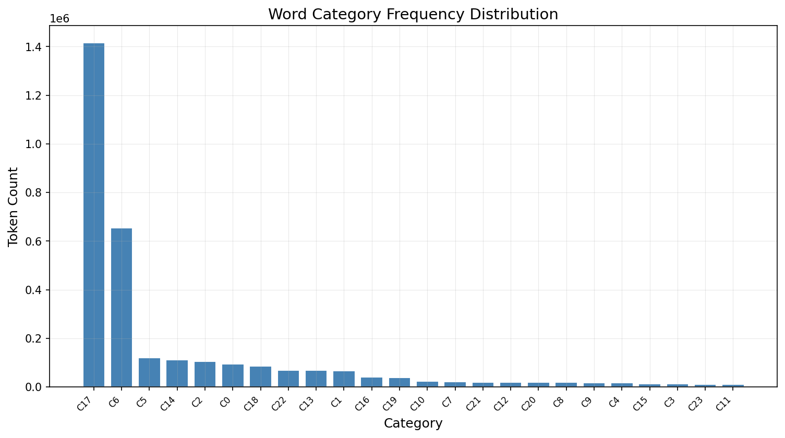
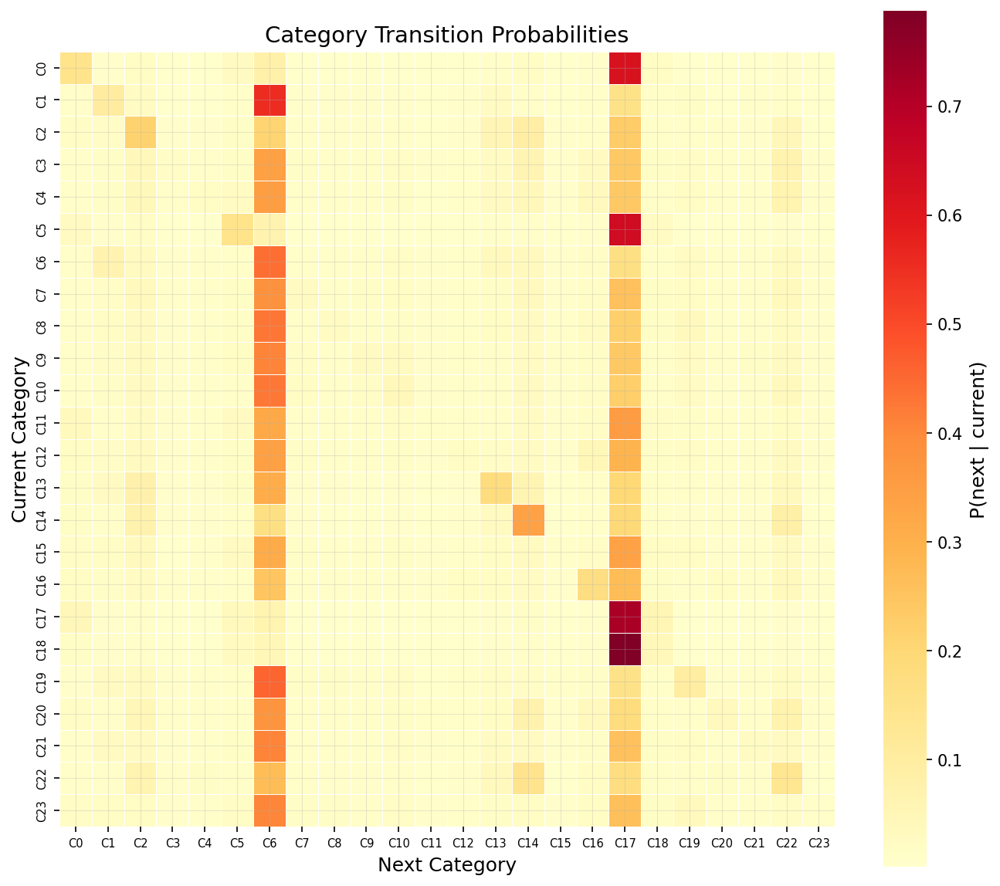
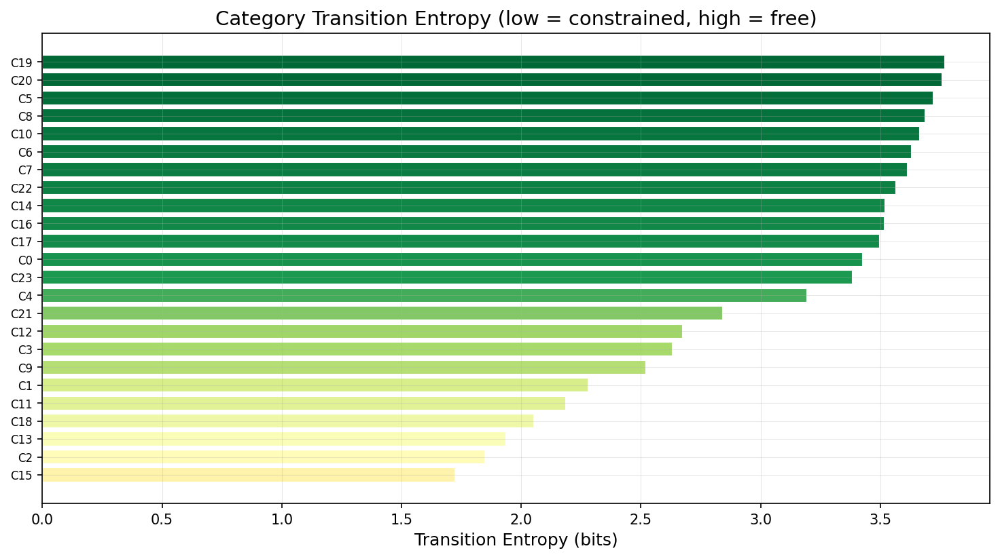
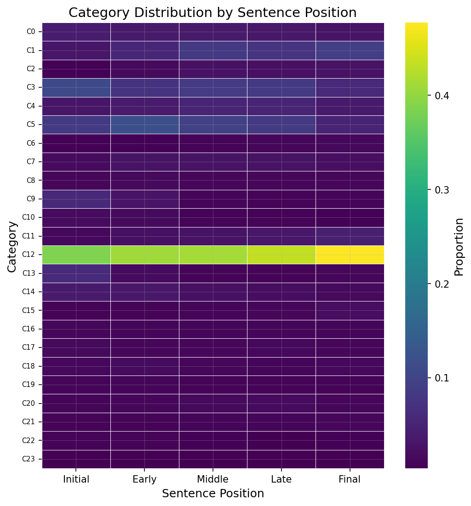
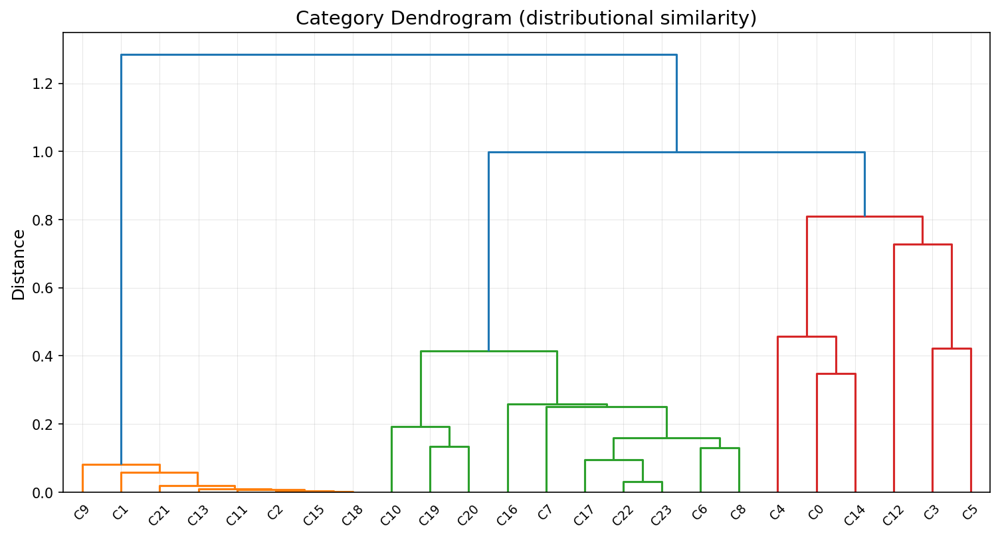
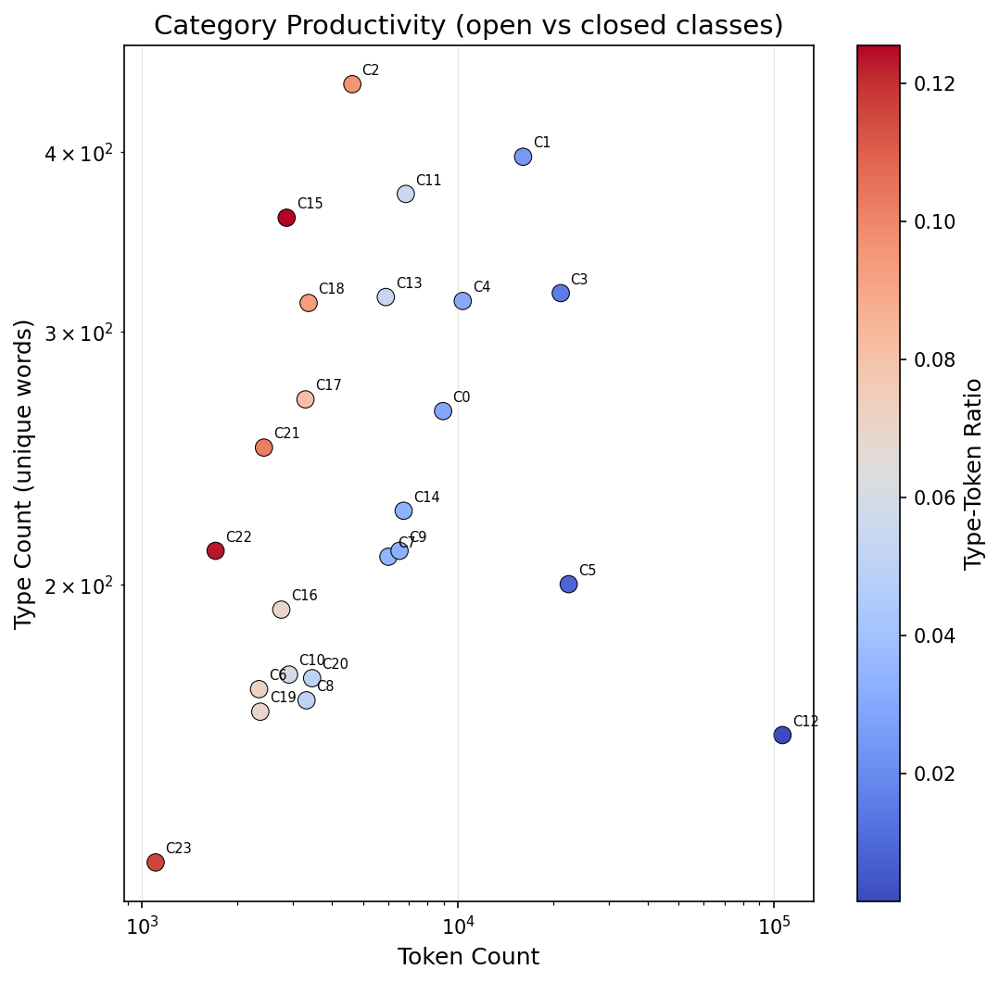
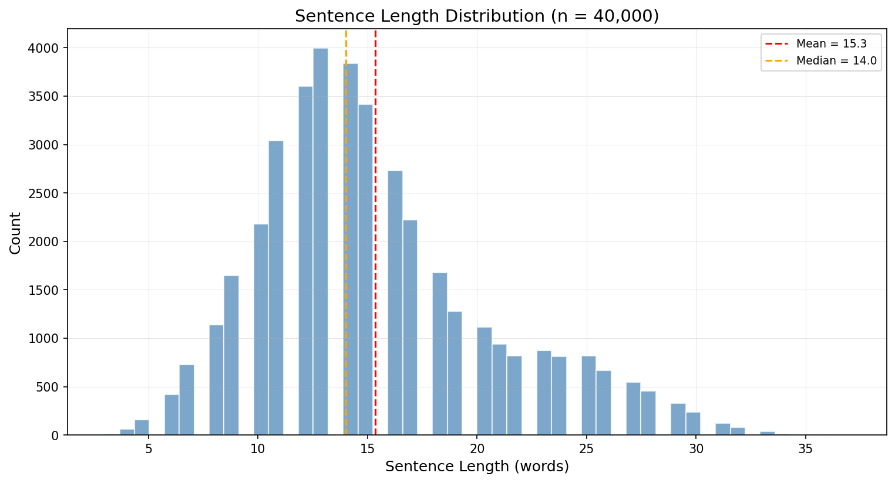
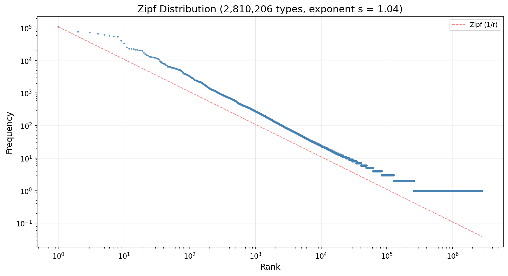
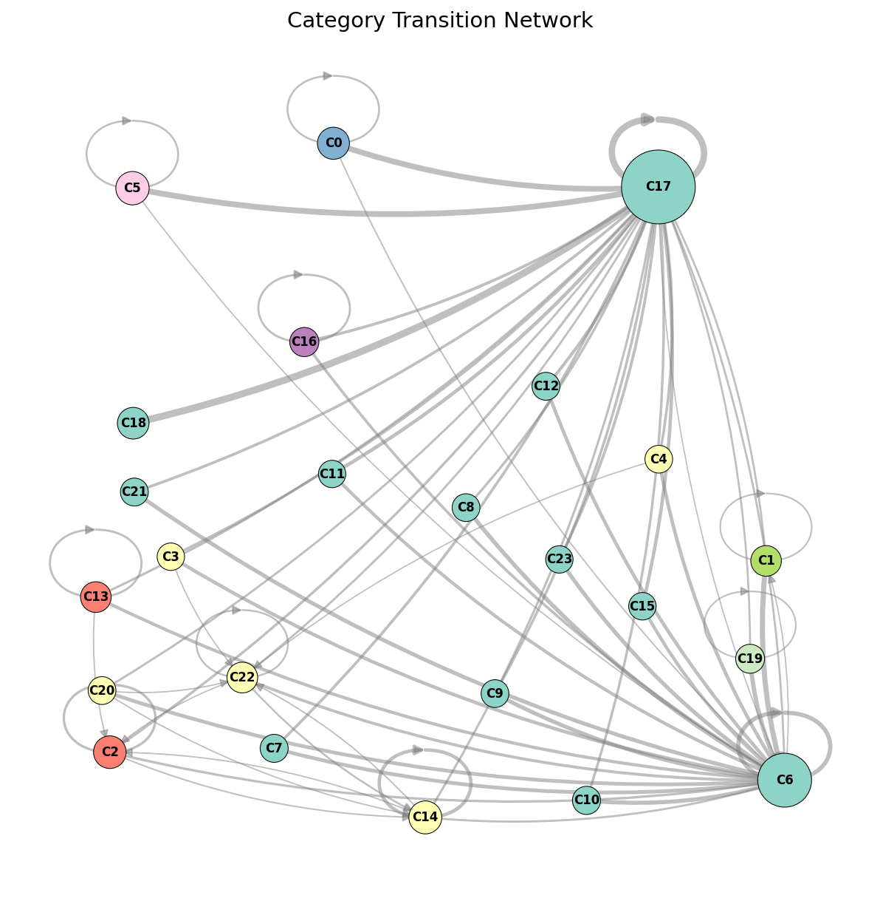
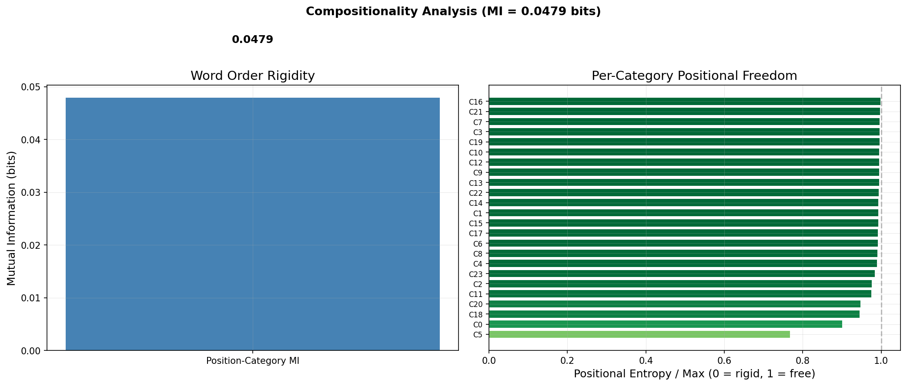

# Corpus Analysis of the Emergent Neuroglot Language

Distributional and grammatical analysis of the Neuroglot dialogue corpus, generated via `lfm visualize grammar`. All results are from the 900K-document natural paragraph corpus produced by the trained dialogue game (98.3% accuracy, v7 full constituency decoder) with isomorphic romanization.

---

**Contents**

1. [Overview](#overview)
2. [Document structure](#document-structure)
3. [Word categories: what they are and how they are induced](#word-categories-what-they-are-and-how-they-are-induced)
4. [Word category distribution](#word-category-distribution)
5. [Syntactic transition structure](#syntactic-transition-structure)
6. [Sentence position preferences](#sentence-position-preferences)
7. [Category hierarchy](#category-hierarchy)
8. [Productivity](#productivity)
9. [Sentence length](#sentence-length)
10. [Zipf's law](#zipfs-law)
11. [Category network](#category-network)
12. [Compositionality](#compositionality)
13. [Implications](#implications)

---

## Overview

The Neuroglot dialogue corpus consists of 900,000 documents (3.6M sentences, 58.7M tokens, 99.998% unique). Each document is a 4-sentence paragraph generated by running a source embedding through the trained dialogue game's multi-turn pipeline:

1. Input embedding (384-dim) enters the DiffusionZGenerator
2. Each of 4 turns is conditioned on the embedding + previous turn context via the ContextTransformer
3. The frozen PhraseDecoder (v7, pretrained on 11.6M phrases from 12 languages) generates IPA tokens
4. Isomorphic romanization maps IPA to unique ASCII sequences (lossless, no Unicode)
5. Output is formatted as a natural paragraph: capitalized sentences, periods, no brackets or markers

The corpus preserves the decoder's multilingual structural priors while presenting text that looks like a natural Latin-script language to the LLM's tokenizer.

```bash
# Reproduce the analysis
poetry run lfm visualize grammar \
  --corpus data/translator/dialogue_corpus_v7_natural.txt \
  --output-dir output/viz-grammar \
  --num-samples 10000
```

## Document structure

Each paragraph consists of 4 sentences elaborating on the same source embedding from different angles. The ContextTransformer conditions each sentence on the hidden states of previous sentences, producing progressive elaboration rather than repetition.

Three representative paragraphs are shown below, first in the original syllable-hyphenated IPA as produced by the decoder, then in the isomorphic romanization used for LLM training. The romanization is a lossless 1:1 mapping from IPA characters to ASCII — every phonemic contrast is preserved, but no IPA Unicode appears in the training data.

**Document 1 — IPA (as generated):**

```
kəː-rɪŋ vjis-ka tak na za-pon-te prjiː-ka eɪdrtj vɝɕːons ɛ-vjɑo-je-liɨ.
aː-rɪŋ t͈ʌ-kxʌ-sɪz kɹieɪ-tʌd t͡ʃok ɑp-tɑ-ʃɯŋ a la-nuːrd pro-vol-maːaːiɕː
b kðoʊz tuzd di-sʌnt ðʌ kɔɹ-tɪŋ ʌ-vʌn. d͡ʑʌl-laj-nɨe podn-zo-na-rit iz
ma-nji-la t͡ɕjes-tji-rəj bi-sa bə-ri vor-datj skjuː-jas e-ɡo t͡ɕːʌ-lɨx
do-mə-ji-ha-da trʃ. ʊ-nɪŋːr a-lax horːt t͡ʃoʊ-nɪŋs naː uːkr ɪt
vo-ku-ɡɛ-daːm ba-hʌ-pɨ s infs tuːa saŋf-ɝtji t͡ɕjuːj̃s s pɹjʌn-sə.
```

**Document 1 — Romanized (as trained on):**

```
Kexxrihng vjiska tak na zaponte prjixka eyudrtj verscxons ehvjaaojeliix.
Axrihng ttuxkxuxsihz krxieyutuxd txok aaptaashuung a lanuxrd
provolmaxaxiscx b kdhowz tuzd disuxnt dhux kawrxtihng uxvuxn.
Djuxllajnixe podnzonarit iz manjila tcjestjirexj bisa bexri vordatj
skjuxjas ego tcxuxlixx domexjihada trsh. Uhnihngxr alax horxt txownihngs
nax uxkr iht vokugehdaxm bahuxpix s infs tuxa sangfertji tcjuxjns s
prxjuxnsex.
```

**Document 2 — IPA:**

```
dɛ sɛ-ɾa pleɪ-sɪ-zla um mɒks xaʌn-tə sɛr-tuʊl-ziat͡-ɕlu di-pʌl
ko-mo-jʌns ju-sot. jaŋ sə-paʊ̯om na-ɡɑ-ton zaɪ̯n sɪ-ta t͡ɕhiu-ru bɒk
vonz-hɑt ba-ru d͡ʑaut so-la-taŋ to-bur sin. sɝom dɛ-doŋt͡-ɕaŋ-si-sɛnt-kɯm
t͡ɕɛ ta-ɰʌn skhoɛs zʊxt mɛ-mwin t͡ɕɛ-ksən ɛ-tɪn-ta laev kwɔɹt-ɝlin ma
ɔ-fɐn də-tʌnz. sɝmi-nen ɡə-rɪŋŋs fɑɹk-tʌd fɹʌm maoʊ-nɯn i d͡ʑuv-di
kloʊn ʔar-dʕhil æt ðʌ sɔŋ ʌp tu paʊ-ɹi mæ-nʌdʒ-ɝi sin dʒʌst bɪzn
pɹʌ-poʊ-zʌl ðʌ ɹoʊ.
```

**Document 2 — Romanized:**

```
Deh sehrra pleyusihzla um maoks xauxntex sehrtuuhlziatsclu dipuxl
komojuxns jusot. Jang sexpawom nagaaton zayun sihta tchiuru baok
vonzhaat baru djaut solatang tobur sin. Serom dehdongtscangsisehntkuum
tceh tamwuxn skhoehs zuhxt mehmwin tcehksexn ehtihnta laev kwawrxterlin
ma awfaxn dextuxnz. Serminen gexrihngngs faarxktuxd frxuxm maownuun i
djuvdi klown qardqhhil aet dhux sawng uxp tu pauhrxi maenuxdzheri sin
dzhuxst bihzn prxuxpowzuxl dhux rxow.
```

**Document 3 — IPA:**

```
æz pi-ɹɔs mʌst ɪ-fɹʌ-kʌnt fɹʌm i-θɛ-tɛn-dʌnt ɪn kɪl-zɛs jɔɹ
æ-dmeɪlz tu ðʌ ɹɪ-mɑn æd-ɕɔɹ-twiʌt ɪn ɛ-ksʌ-lʌnt kɛɹ. æz po-kɐ-mos
kwɛ ʋɑi-no ɐ-kon-nostj daʔs ɛ suɐ pɐɾ-tɛɐ dɛ ɐɾ-mos ɐ wɛl-zɛɾ ɛm
o-wi-sɐ sɛ-ksɐ-ɾa pɐ-ɾɐ sew po-dɛ-do ɛ-nːo-lɛ. ʌnd fɔɹst nu-mʌ-neɪ
kʊd mits ʌv leɪk ɛ-ʃʌ-lʌnt æ-tʌmz ðʌ ɡʌv-ɝmʌnt tu meɪk kʌ-mɪŋ oʊvɝ
ɹi-sɔɹs ɡɹæ-sʌl ʌ pɹɑ-sɪ-kjʌlɝ tu ðʌ dɪt-ɝmʌ-nən fɔɹ dɹu hi
dɪf-ɝɛn-sɪk ʌnd wɪl leɪt hɪm. qrrːint͡s aːs ɰi-muː-loɡ ko
d͡ʒjaːu-nlɛ-maː-tiɒ bo-traːn hoɟ ɒ ko-lːouʃ-ti-nɒk ʃɒn-hø-ɡeːn ki
ki-ʃːiː saː-maː-jaːk asrt͡s-ta.
```

**Document 3 — Romanized:**

```
Aez pirxaws muxst ihfrxuxkuxnt frxuxm ithehtehnduxnt ihn kihlzehs jawrx
aedmeyulz tu dhux rxihmaan aedscawrxtwiuxt ihn ehksuxluxnt kehrx. Aez
pokaxmos kweh vvaaino axkonnostj daqs eh suax paxrrtehax deh axrrmos ax
wehlzehrr ehm owisax sehksaxrra paxrrax sew podehdo ehnxoleh. Uxnd
fawrxst numuxneyu kuhd mits uxv leyuk ehshuxluxnt aetuxmz dhux
guxvermuxnt tu meyuk kuxmihng owver rxisawrxs grxaesuxl ux prxaasihkjuxler
tu dhux dihtermuxnexn fawrx drxu hi dihferehnsihk uxnd wihl leyut hihm.
Qrrxints axs mwimuxlog ko dxjaxunlehmaxtiao botraxn hojj ao
kolxoushtinaok shaonhougexn ki kishxix saxmaxjaxk asrtsta.
```

### Linguistic phenomena at multiple scales

**Phonotactic level** — syllable structure follows natural constraints. In the IPA for Document 1, onsets rise in sonority (`kɹie-`, `pɹjʌ-`, `skjuː-`) and codas fall (`-lɨx`, `-datj`, `-ɡɛ-daːm`), consistent with the Sonority Sequencing Principle. The romanization preserves this structure: `krxiey-`, `prxjux-`, `skjux-` maintain the consonant cluster patterns.

**Morphological level** — productive affixation is visible across documents. In Document 2's IPA, the root `sɝ-` appears in both `sɝom` (sentence 3) and `sɝmi-nen` (sentence 4) with different suffixes, suggesting a productive stem. In Document 3, the prefix `ɪ-`/`ɛ-` attaches to different roots: `ɪ-fɹʌ-kʌnt`, `ɛ-ksʌ-lʌnt`, `ɛ-ʃʌ-lʌnt` — a derivational pattern producing modifier-like forms. The suffix `-uxnt`/`-uxnz` recurs across documents (`disuxnt`, `ehksuxluxnt`, `dextuxnz`) as what appears to be an inflectional ending.

**Word-level** — function words emerge naturally. Short, high-frequency words like `tu`, `dhux`, `ihn`, `uxnd`, `deh`, `ko` appear repeatedly across documents, serving connective roles analogous to prepositions, articles, and conjunctions. These are distinct from the longer, lower-frequency content words that carry document-specific meaning.

**Phrase level** — recurring category sequences suggest phrase templates. Patterns like `deh + content + content` (Document 2, sentence 1: `deh sehrra pleyusihzla`) and `uxnd + content + content` (Document 3, sentence 3: `uxnd fawrxst numuxneyu`) mirror determiner-noun or conjunction-phrase structures.

**Discourse level** — paragraphs maintain typological consistency. Document 1 stays in a mixed Slavic-agglutinative register throughout. Document 2 opens Romance (`deh sehrra`), shifts to Austronesian-like patterns (`jang sexpawom`), and closes with Germanic morphology (`dzhuxst bihzn prxuxpowzuxl`). Document 3 blends English-like syntax (`dhux guxvermuxnt tu meyuk`) with Romance (`pokaxmos kweh vvaaino`) and Uralic-like agglutination (`kolxoushtinaok`). The context transformer ensures each sentence builds on the previous one's typological character while introducing variation.

**Cross-sentence cohesion** — vocabulary recycling creates referential consistency. In Document 2, the roots `sehrr-`/`serm-` recur across sentences 1, 3, and 4. In Document 3, `frxux-` appears in both sentences 1 and 3 (`frxuxm`, `frxuxkuxnt`). This is not random — the context transformer conditions each turn on the previous turns' hidden states, producing lexical continuity.

## Word categories: what they are and how they are induced

The visualizations in this document refer to "categories" labeled C0 through C23. These are the Neuroglot analog of parts of speech — groups of words that behave similarly in context.

In natural languages, parts of speech (noun, verb, adjective, etc.) are defined by distributional behavior: nouns appear after determiners, verbs take objects, adjectives precede nouns. A word's syntactic role is determined not by what it means but by where it appears and what it appears next to. This is the distributional hypothesis: words that occur in similar contexts belong to the same category.

We apply this principle to the Neuroglot corpus to discover its grammatical categories without any human annotation:

1. **Co-occurrence vectors**: for each word that appears at least 5 times in the corpus, we build a vector counting which other words appear within a 2-word window. This captures the word's distributional context — the company it keeps.
2. **PPMI + SVD**: the raw co-occurrence counts are transformed to Positive Pointwise Mutual Information (emphasizing informative co-occurrences over frequency effects), then reduced to 50 dimensions via Singular Value Decomposition. Each word is now a point in a 50-dimensional distributional space.
3. **KMeans clustering**: words are grouped into 24 clusters based on proximity in this distributional space. Words that appear in similar contexts end up in the same cluster.

The result is 24 word categories — groups of words that play similar syntactic roles in Neuroglot. These are not predefined or supervised; they are discovered purely from the statistical patterns in the corpus. When we observe that category C15 has low transition entropy (it almost always precedes specific other categories), we interpret this the same way a linguist would interpret a determiner class — it's syntactically constrained, appearing in a fixed structural position relative to other elements.

The categories are labeled C0-C23 arbitrarily — the numbers have no inherent meaning. What matters is the relationships between categories: which ones follow which, which ones are positionally constrained, which ones are productive, and how they cluster hierarchically.

## Word category distribution

Distributional clustering reveals a Zipfian distribution across the 24 induced categories:



A single dominant category (C17, ~1.4M tokens) acts as the general content word class, followed by C6 (~650K) as a secondary content class, then a power-law tail of progressively rarer categories. This mirrors the distribution of part-of-speech tags in natural languages, where nouns and verbs dominate and closed-class function words are fewer in type but high in frequency.

## Syntactic transition structure

The category-to-category transition probability matrix reveals structured syntactic patterns:



Two dark columns at C17 and C6 show that most categories transition to these dominant content classes. The strongest transition hotspot is C17→C18 and C18→C17, suggesting a tightly coupled syntactic pair (possibly modifier-head or head-complement). Off-diagonal hotspots indicate specific syntactic relationships, and several categories show strong preferences for specific successors rather than transitioning uniformly.

Transition entropy quantifies how constrained each category's syntactic behavior is:



Low-entropy categories (C18 at ~1.5 bits, C17 and C5 at ~1.9-2.0 bits) are syntactically constrained — they transition to a small set of successors, behaving like function words or determiners. High-entropy categories (C22, C16, C20 at ~3.3 bits) are syntactically free, appearing in varied contexts like open-class content words. This function/content word distinction emerges without supervision from the decoder's multilingual pretraining.

## Sentence position preferences

The distribution of categories across sentence positions (initial, early, middle, late, final quintiles) reveals word order regularities:



C17 (dominant content class) distributes relatively uniformly across all positions, consistent with content words in free word order languages. C6 shows a strong preference for initial and early positions (sentence opener). C5 also clusters at sentence-initial position. These positional preferences indicate genuine word order structure, not random token placement.

## Category hierarchy

Hierarchical clustering of categories by their transition probability profiles reveals macro-level phrase groupings:



Three major branches emerge: an orange cluster (C6, C17 — the two dominant categories, tightly paired), a green cluster (C0, C5, C18 — syntactically constrained categories that form a function-word group), and a large red cluster containing the remaining content categories with diverse syntactic behavior. These groupings suggest phrase-level structure analogous to NP, VP, and PP groupings in natural language syntax.

## Productivity

Type-token ratio per category distinguishes open (productive) from closed word classes:



C18 stands out in the upper-center: high type count (~7K unique words) with moderate token count — a highly productive open class generating many novel word forms. C17 occupies the far bottom-right: extremely high token count (~1.4M) with relatively low type count (~3.7K unique words, TTR ~0.003) — a closed-class pattern where a small vocabulary is reused very frequently, suggesting function-word-like behavior. C6 shows a similar closed-class pattern. Categories in the upper-left (high TTR, red coloring) like C11, C23, C3 are low-frequency but highly productive.

## Sentence length

Sentence lengths follow a natural bell-curve distribution:



Mean sentence length is 15.3 words (median 14.0), with a range of 3-37 words. This distribution is comparable to sentence lengths in natural language corpora (English averages 15-20 words per sentence). The right-skewed tail reflects the variable-length encoding of the decoder — more complex inputs produce longer utterances. These statistics are stable across sample sizes (identical at 10K and 100K paragraphs).

## Zipf's law

Word frequencies follow near-perfect Zipf's law with exponent s = 1.04:



2,810,206 unique word types across 100K paragraphs (400K sentences). The fitted exponent of 1.04 is within the range observed for natural languages (typically 0.9-1.1). This is significant because emergent communication systems typically produce anti-Zipfian (uniform) or degenerate distributions. The Zipfian structure here is inherited from the frozen decoder's natural language prior and confirms the output is linguistically structured, not an efficient code.

## Category network

The category co-occurrence network visualizes syntactic "highways" between word classes:



C17 acts as the central hub — nearly all other categories connect through it, consistent with its role as the dominant content class. C6 serves as a secondary hub. Peripheral communities (clusters of tightly connected categories) suggest phrase-level units that internally cohere before connecting to the broader syntactic network. Self-loops on several categories indicate self-compounding or sequential modifier patterns.

## Compositionality

Mutual information between word position and category assignment measures word order rigidity:



The overall position-category MI is 0.048 bits — low, indicating relatively free word order. This is expected from a decoder pretrained on 12 typologically diverse languages spanning SOV (Turkish, Korean), SVO (English, Portuguese), VSO (Arabic), and free-order (Hungarian) word orders. The decoder learned to produce valid output across all these patterns, so its output naturally has flexible word order rather than being locked to any single syntactic template.

Per-category positional entropy shows that most categories are positionally free (entropy near maximum). Categories C0 and C5 show lower positional freedom, suggesting they serve as structurally anchored elements — likely sentence-initial markers or obligatory position fillers.

## Implications

The corpus exhibits the following properties of natural language grammar, all emergent from the frozen decoder's multilingual pretraining:

1. **Distinct word classes** — distributional clustering recovers POS-like categories with different syntactic behaviors
2. **Function/content distinction** — low-entropy (constrained) vs high-entropy (free) categories mirror the closed/open class division
3. **Word order regularities** — categories show positional preferences without rigid order, consistent with typologically diverse pretraining
4. **Phrase structure** — hierarchical clustering of transition profiles reveals macro-level groupings analogous to phrase types
5. **Productive morphology** — open classes show high type-token ratios, indicating the decoder generates novel word forms
6. **Zipfian vocabulary** — near-perfect Zipf's law (s=1.04) over 2.8M word types, ruling out degenerate or anti-Zipfian coding
7. **Natural sentence length** — mean 15.3 words with a right-skewed distribution, comparable to human language

These structural properties are what enable cross-lingual transfer when an LLM learns Neuroglot alongside English. The LLM's existing machinery for recognizing syntactic categories, transition patterns, positional regularities, and phrase structure can engage with Neuroglot because these features are present — they were inherited from the same 12 human languages that the LLM itself was trained on.
