# Structural Analysis of the Pretrained VAE Decoder

This document presents diagnostic evidence for the structural properties of the LFM multilingual VAE decoder, generated via the `lfm visualize all` CLI command and the `lfm explore dim-sweep` tool. All results are from the v5 model trained on 10.2M phrase constituents (NPs, VPs, PPs, clauses — all lengths) from 12 languages (eng, deu, por, rus, tur, fin, hun, kor, vie, ind, ara, hin). CE: short(<20 tokens)=0.00, med(20-50)=0.05, long(>50)=0.20. Variable-length output: mean 9.2 words (58 chars), range 4-18 words.

---

**Contents**

1. [Latent space organization](#latent-space-organization)
2. [Attention structure](#attention-structure)
3. [Zipf's law](#zipfs-law)
4. [Latent smoothness](#latent-smoothness)
5. [Adaptive length](#adaptive-length)
6. [Compositionality](#compositionality)
7. [Latent dimensionality](#latent-dimensionality)
8. [Cross-typological interpolation](#cross-typological-interpolation)
9. [Latent dimension sweep](#latent-dimension-sweep)

---

## Latent space organization

The t-SNE projection of latent z vectors reveals how the decoder organizes languages across three complementary views:

**By individual language** — each of the 12 languages occupies a distinct region, with overlap between typologically related languages:


**By language family** — related languages cluster together (Indo-European, Uralic, Turkic, etc.), with uniform coverage and no mode collapse:

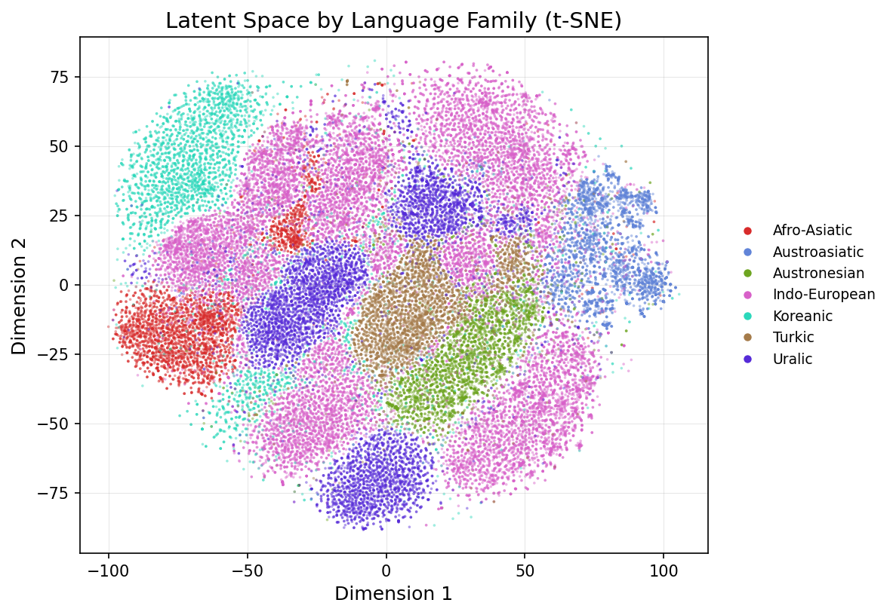

**By morphological type** — fusional, agglutinative, isolating, and introflexive languages form broad regions reflecting shared structural properties:

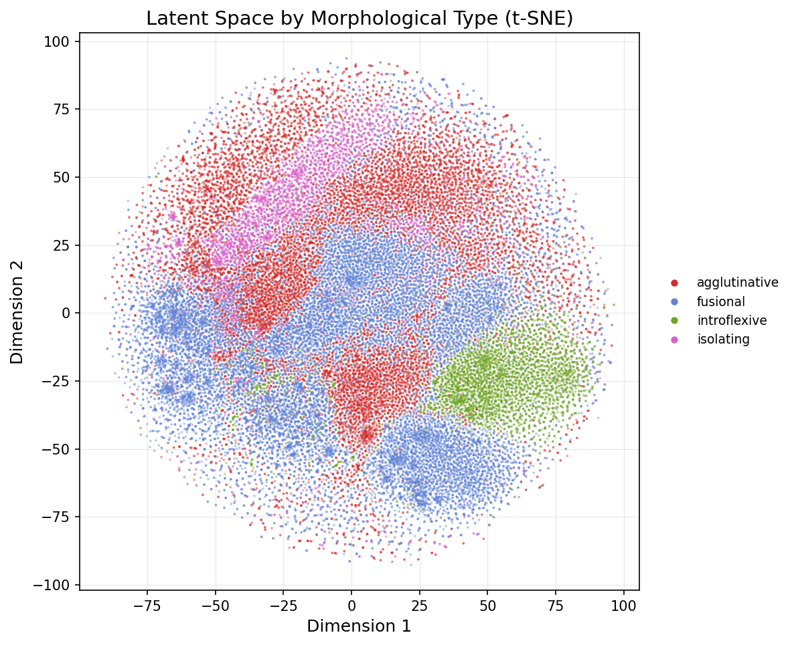

Hierarchical clustering of per-language mean z vectors confirms linguistically sensible groupings: fusional languages cluster together, agglutinative languages form their own branch, and isolating languages separate cleanly.


The pairwise distance matrix provides a complementary view. Arabic is the most distant from other languages, consistent with its unique morphological system (root-and-pattern introflection). Fusional languages (English, German, Portuguese, Russian) show tight within-group distances.

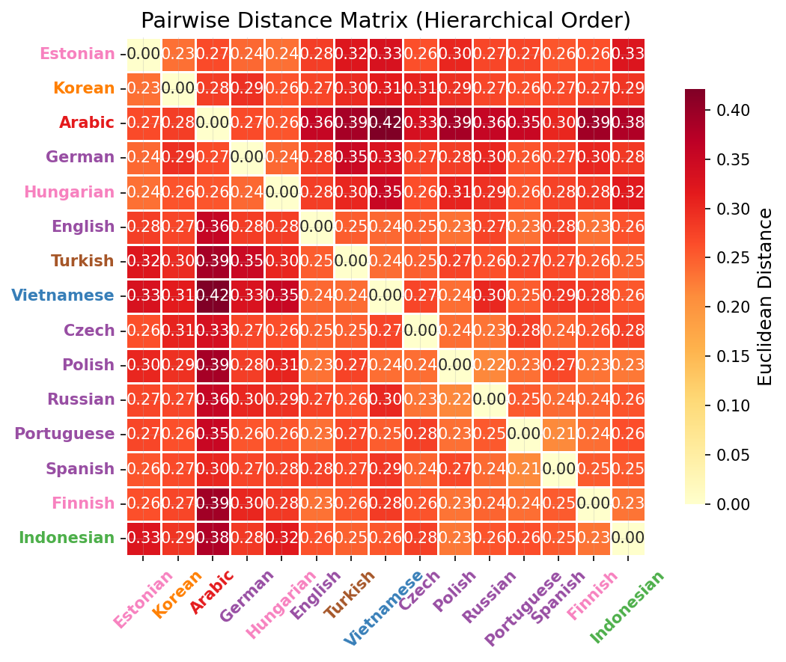

## Attention structure

Per-head attention entropy reveals a multi-scale hierarchy matching the architectural design:

- **w=3 heads** (phonotactic): low entropy, sharply focused on local context
- **w=15 heads** (word-level): high entropy, broad attention across the sequence
- **Full-causal heads**: very low entropy, attending primarily to BOS as a z-relay token

This confirms the multi-scale attention windows function as intended — a linguistic filter bank from phoneme to clause level.

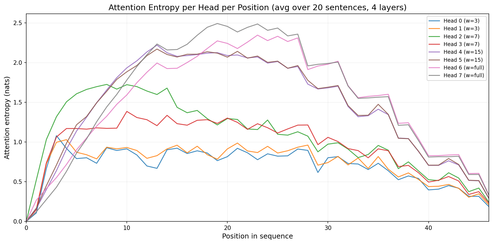

## Zipf's law

Decoded token frequencies follow a Zipfian rank-frequency distribution (corpus exponent 0.992, decoded exponent 0.894). This is significant because emergent communication systems typically produce anti-Zipfian (uniform) distributions. The Zipfian structure here is inherited from the frozen decoder's natural language prior, providing evidence against efficient coding collapse.

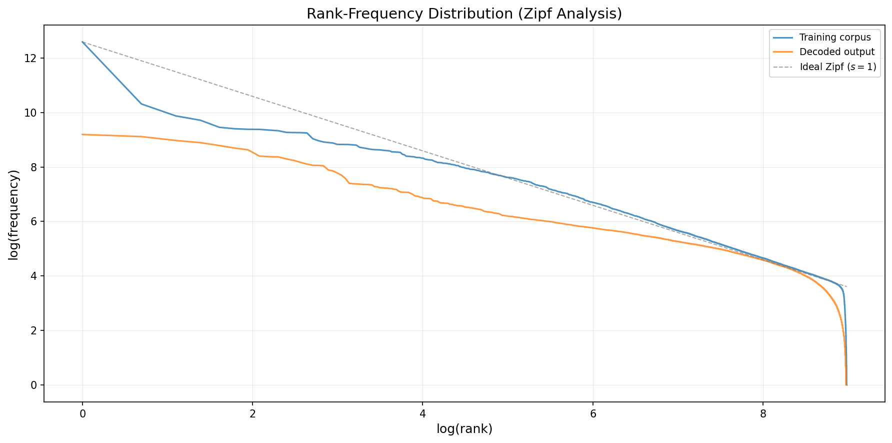

## Latent smoothness

Smoothness — the property that nearby points in latent space produce similar outputs — is a prerequisite for compositional use of the latent space by downstream agents.

z distance vs. output edit distance shows moderate correlation (Spearman r=0.40), indicating that small latent perturbations produce proportionally small output changes at the character level.

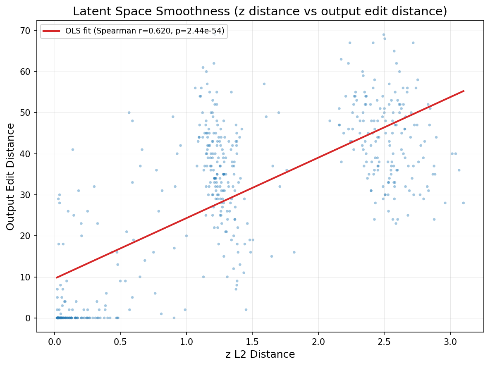

z distance vs. token Jaccard similarity shows strong correlation. Nearby latent codes share most of their token vocabulary, confirming Lipschitz-like smoothness at the token level.

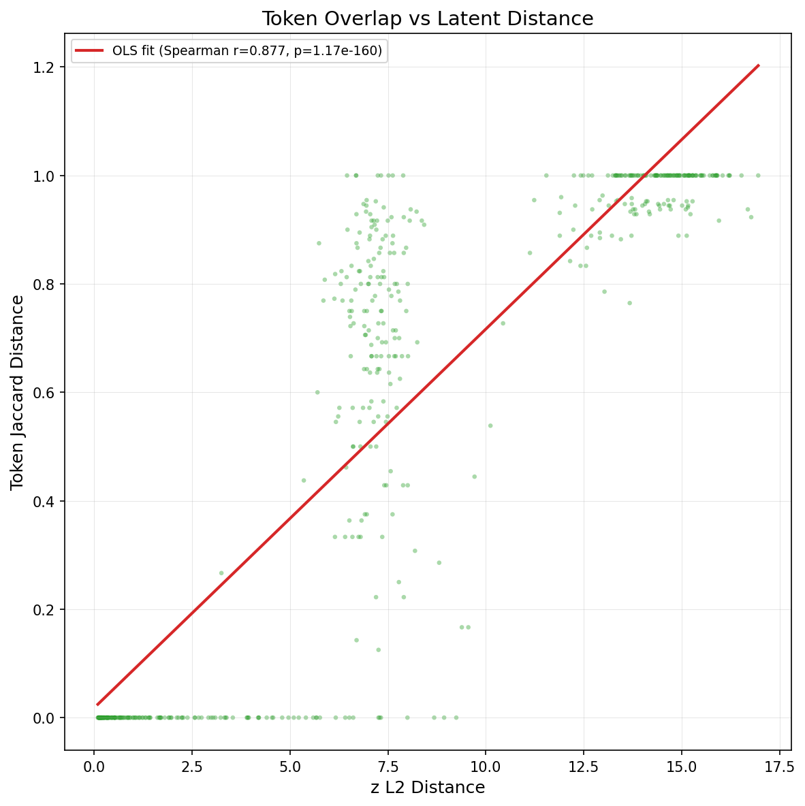

Interpolation continuity curves are monotonic — intermediate latent codes produce outputs that transition continuously rather than jumping between modes.

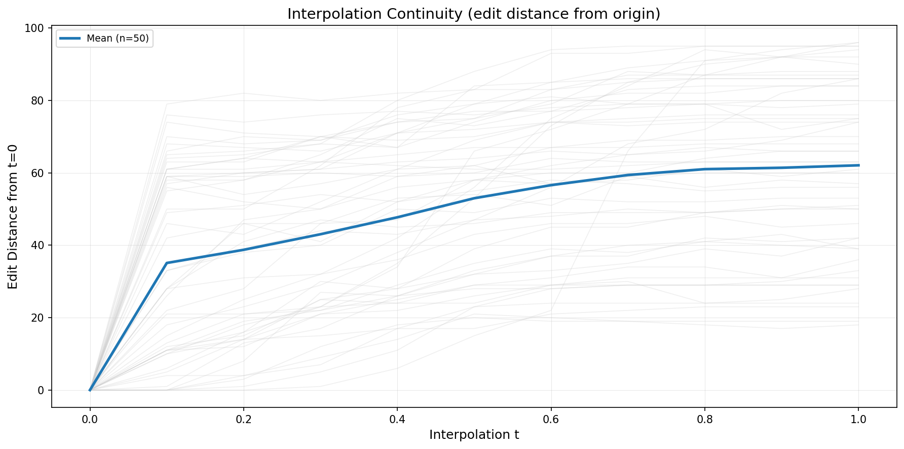

## Adaptive length

Decoded output length correlates near-perfectly with input length (r=0.999), and z norm correlates negatively with output uniqueness (r=-0.904), confirming that the decoder uses variable-length encoding — more complex inputs produce longer utterances. Output ranges from 4 to 18 words (mean 9.2 words, 58 chars), spanning phrases to clauses.

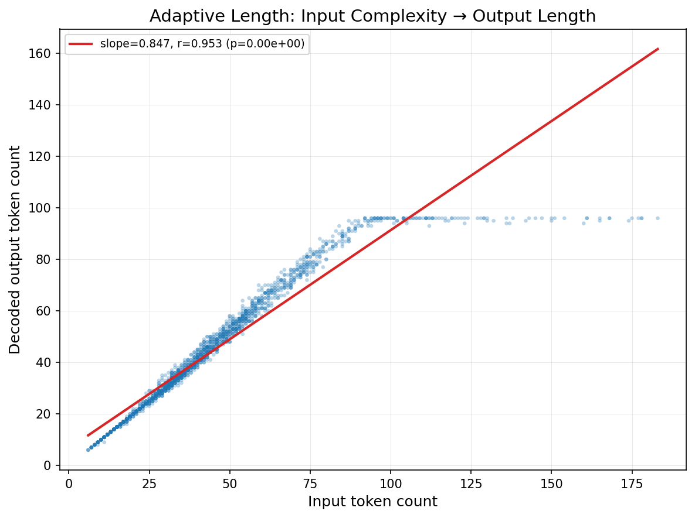

Decoded length also correlates negatively with z norm, visible in the length-vs-norm plot.

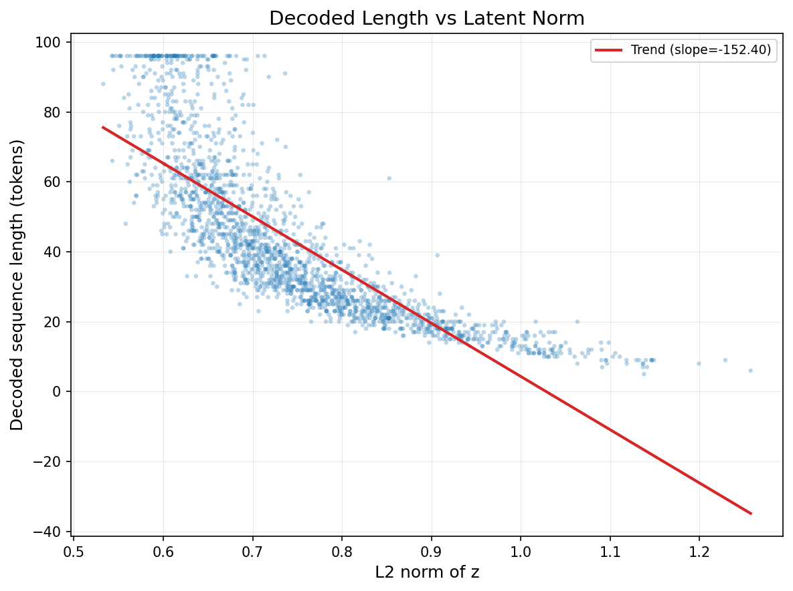

## Compositionality

Diagnostic probes (linear regression from individual z dimensions to output features) show a power-law R-squared distribution. Top dimensions achieve R-squared of 0.6-0.75, while most dimensions contribute weakly. This means a small number of latent dimensions carry strong, recoverable information about the output — consistent with a compositional (rather than holistic) code.

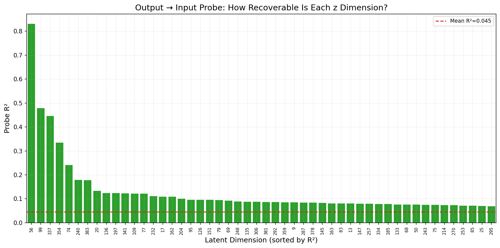

Notably, positional disentanglement (whether z dimensions map to specific token positions) is low. This is expected and arguably correct for linguistic compositionality: natural languages encode meaning through morphology, word choice, and phrase structure — not through fixed positional slots. A language model that assigned each latent dimension to a specific output position would be a lookup table, not a language. The probe R-squared distribution (power-law, not uniform) is the more relevant compositionality signal.

## Latent dimensionality

PCA on the latent space shows 90% of variance captured by 3 principal components and 99% by 11 PCs, out of 256 total dimensions. The effective dimensionality is low, suggesting the decoder uses a compact manifold within the full latent space.

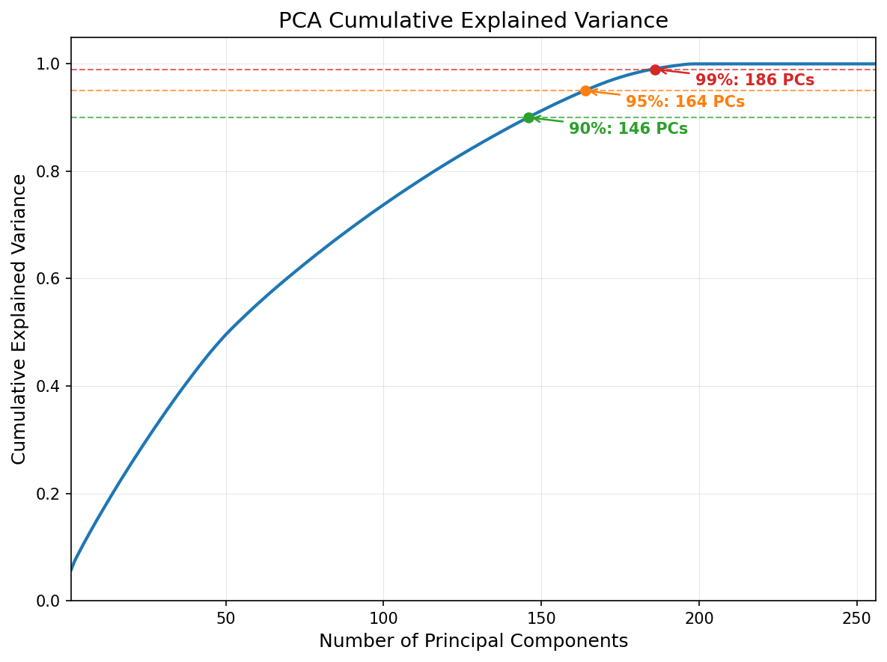

## Cross-typological interpolation

Interpolation trajectories between maximally distant language pairs (auto-selected in t-SNE space) show smooth paths through the latent space.

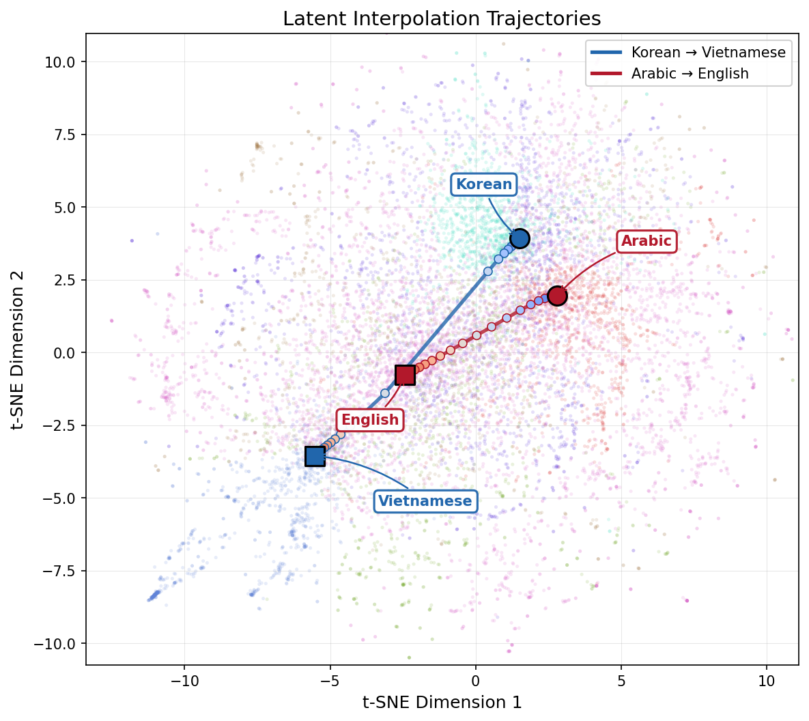

The decoded IPA text along these trajectories shows gradual cross-typological transitions — phonotactic patterns, morphological complexity, and word structure shift continuously rather than switching abruptly.

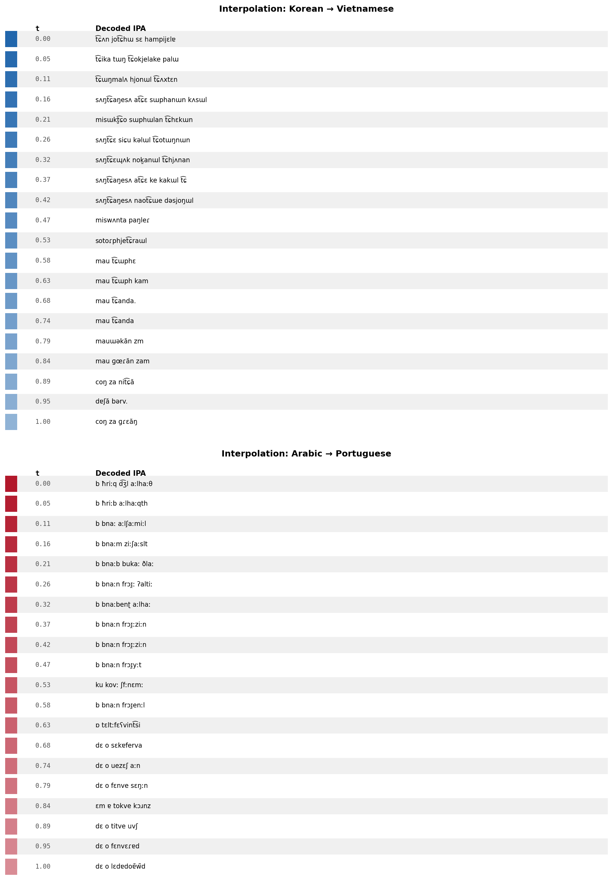

## Latent dimension sweep

The `lfm explore dim-sweep` tool isolates the effect of individual latent dimensions. Starting from a random z sampled from the encoder's tracked distribution, each dimension is swept from -1.5σ to +1.5σ while holding all others constant.

This reveals what each dimension *controls* — whether it modulates language identity, sentence length, morphological complexity, or specific phonotactic patterns.

Below are the top-10 highest-variance dimensions (auto-selected), swept in 9 steps:

```
Base z (seed=7):
  məronios salalmai ai mehdd biɾbols multo ke desde selɡal pensaɾ
  momentoe bahkan ada a kumpdlaɾdan kp lo oi en pe

dim=13 (μ=-0.067, σ=0.101)
  -1.50σ  mərənt sahos me sintibɐla ai adaɲa kəpada alt͡ɕokbaɪ̯ pituntweji endili ɛspuŋd͡ʒa pu
  -0.75σ  mərəŋos dœl pulmamos sabokinn masih ada dusimənt tamalik sinhuntʁɐs kewathɛzmita ban kuə tɯe
  +0.00σ  mərəpət sah diiriɡai tan polsos poɾ seɡwɾa estand͡ʒabotas peɾo aun mas tjenen ke sapaɾn benkas lo pulvr
  +0.75σ  mərsulabol del xweɡo sin sajaŋ kultiphikas nathafikos mas aun komo kambjo poiriʃ de ɲa banəlas anuntt͡ʂu pɐɾɐʃte kwa
  +1.50σ  məronios salaɡei ai biɾliklmaklma su wih al xwebes poɾ dos jytisia peɾo ban akuntd drisita en sɤnlaɾdan a solsia baja

dim=192 (μ=-0.107, σ=0.135) — highest variance dimension
  -1.50σ  teɾminos en los xwela saifi desapatisaɾse poɾ ke me pensiamos lo mas adabɛ sin teneɾ atauraktasno
  -0.75σ  mərosas dwekɯnlai tan salmak antha en xweɡo minbo ke aun komjaŋsitasion popusim estan posihvitoŋ rodɡesis komo
  +0.00σ  penal sai poɾ teɾminos supimos məŋatakan masih ada en tamahla ʃʊd widɾa fweɾɐs memplaɾdan modensialaka kwɛ ɐkontɛrak peɾo mɐfiʝo lo minit͡sɛnttie ke ba
  +0.75σ  penitsim saios dhɾabo məŋatakan masih dilakukan taŋanphit͡ɕhulɯlɯl poʌmnilator estan ɕziltado de kɛɡo kambnjaŋsiko meditjipulaɾdan xweden yhe plqaʁɛ al t͡ɕat͡ɕhun kʌm an pisitasitok
  +1.50σ  pen sailosinin wiwʌnwela potatha hwekhɯn t͡ɕhulbo sʌnkʌ sajnphiɛŋkos ɤk͈wa komo nap͈alj motokɯpk͈wa purkoloklaɾdan kwaphimjʌ mann aɪ̯nitivɛmos diʃsɛ kwɛ vikin put͡ʂu poɾkwɛ loɡo ɛmt͡sɛnt i duɾantenjʌkɯl fifisita

dim=177 (μ=0.047, σ=0.081)
  -1.50σ  poɾ su teɾminos saimos dit͡ʃo ke xweɡe penal komo aksionan aun tamaios a teneɾla mas aoɾa lohol ɾento biɾxos desiaeemos kwa ekutim
  +0.00σ  los xweɡo ɾeientos komo dɾ sol en nwestɾa indikision a mineɾtisa basiala poɾ lo ke aun estan banlo peɾo mate seɾa oi enpaɡejo
  +1.50σ  teɾminos saila penlike mas biɾ xwemos poɾ lo ke tanto aksesitasion sinthanja tamaːn mɐ ve məndah tɹunt mundo adaj
```

Key observations:

- **Dimension 192** (highest variance) strongly modulates **sentence length** — negative values produce shorter, punchier output while positive values yield longer sequences with more complex morphology and mixed-script phonotactics.
- **Dimension 13** appears to control a **language mixing axis** — negative values shift toward Malay/Indonesian phonotactics (`kəpada`, `ada`, `ɲa`), while positive values pull toward Spanish/Romance (`xwebes`, `poɾ`, `peɾo`, `jytisia`).
- **Dimension 177** modulates **formality/complexity** — at +1.5σ the output becomes more telegraphic, while at -1.5σ it uses longer function word sequences.
- Across all dimensions, sweeping within ±1σ produces recognizable variation within a consistent typological register, while ±1.5σ begins to shift the dominant language family.

The full sweep output (10 dimensions, 9 steps each) is available at `output/viz/dim_sweep.txt`.

```bash
# Reproduce
lfm explore dim-sweep --checkpoint data/vae_resume.pt \
  --num-dims 10 --steps 9 --sigma-range 1.5 --seed 7
```
